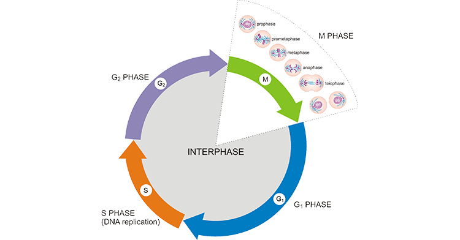

# Cell Cycle

The cell cycle is the fundamental process by which a single cell grows,
replicates its DNA, and divides into two daughter cells. In eukaryotes,
this cycle is a tightly regulated sequence of events designed to ensure
the faithful transmission of genetic information. The cycle includes
periods of growth and DNA synthesis collectively called interphase,
followed by mitosis and cytokinesis, which divide the nucleus and
cytoplasm, respectively.

Errors in this complex cycle can lead to genomic instability and are
often implicated in diseases such as cancer. Understanding the molecular
mechanisms underlying the cell cycle is crucial to comprehending how
cells function, develop, and occasionally malfunction.

The cell cycle is divided into four major phases:

-   **G1 Phase (First Gap)**: The cell grows and prepares enzymes and
    nutrients needed for DNA replication.

-   **S Phase (Synthesis)**: The entire genome is replicated. DNA
    polymerase is the major enzyme involved in the replication process.

-   **G2 Phase (Second Gap)**: The cell continues to grow and produce
    proteins and enzymes required for mitosis, including cyclins and
    CDKs.

-   **M Phase (Mitosis and Cytokinesis)**: The cell undergoes nuclear
    division followed by division of the cytoplasm.

Figure 1: Phases of cell cycel

[Image Credit](https://www.cusabio.com/Cell-Biology/Cell-Cycle.html)

## INTERPHASE: PREPARING FOR DIVISION

Interphase is the longest stage of the cell cycle and is subdivided into
three distinct phases: G1, S, and G2. During this phase, the cell is
metabolically active, synthesizing all necessary components required for
cell division.

### G1 Phase: Cellular Growth and Preparation

During the G1 phase (first gap phase), the cell grows in size and
produces RNA, enzymes, and various proteins needed for DNA replication.
The centrosome begins to duplicate in preparation for mitosis. This
phase is crucial for determining whether the cell will commit to
division. If conditions are unfavorable, the cell may enter a quiescent
state known as G0.

Important regulators in this phase include cyclin D and CDK4/6. These
proteins form complexes that drive the cell past the G1 checkpoint (also
known as the restriction point). If DNA damage is detected, the tumor
suppressor protein p53 becomes activated. p53 halts the cell cycle by
inducing the expression of p21, an inhibitor of CDK activity, giving the
cell time to repair damage.

### S Phase: DNA Replication

Once the cell passes the G1 checkpoint, it enters the synthesis (S)
phase. Here, the cell replicates its entire genome so that each daughter
cell receives an identical set of chromosomes. Each chromosome forms two
sister chromatids joined by a centromere.

The enzyme DNA helicase unwinds the double-stranded DNA, while DNA
polymerase synthesizes the new complementary strands. Primase lays down
RNA primers, and DNA ligase seals the gaps between Okazaki fragments on
the lagging strand. Histone proteins are also synthesized during this
phase to help package the replicated DNA into chromatin.

Errors in DNA replication can result in mutations if not corrected.
Deficiencies in DNA repair enzymes (e.g., BRCA1/2, MSH2, MLH1) can lead
to hereditary cancers such as breast and colorectal cancer.

### G2 Phase: Final Preparations

The G2 phase is the final preparation for mitosis. The cell continues to
grow and produces microtubules and other proteins essential for
chromosome segregation and cytokinesis. The centrosomes complete their
duplication, and mitotic spindle components begin to form.

At the G2/M checkpoint, the cell checks that all DNA has been accurately
replicated and that no damage is present. Proteins such as ATM and ATR
detect DNA damage and initiate repair pathways. If damage cannot be
repaired, p53 may again trigger cell cycle arrest or apoptosis.

### MOLECULAR CONTROL OF MITOSIS

Mitosis is tightly regulated by a complex network of proteins,
particularly:

-   **Cyclins**: Regulatory proteins whose concentrations vary
    cyclically in the cell.

-   **Cyclin-dependent kinases (CDKs)**: Enzymes that, when bound to
    cyclins, phosphorylate target proteins to trigger progression
    through the cell cycle.

-   **Anaphase-Promoting Complex/Cyclosome (APC/C)**: A ubiquitin ligase
    that marks securin and mitotic cyclins for degradation, allowing the
    separation of sister chromatids and exit from mitosis.

Checkpoints ensure the integrity of the process:

-   **G2/M Checkpoint**: Verifies DNA replication completeness and
    damage repair.

-   **Spindle Assembly Checkpoint (SAC)**: Prevents anaphase onset until
    all chromosomes are properly attached to spindle fibers.

## MITOSIS: THE DIVISION OF THE NUCLEUS

Mitosis is a vital process that ensures the accurate division of the
nucleus and its genetic material. It occurs in somatic cells and results
in two daughter cells that are genetically identical to the parent cell.
Mitosis is essential for growth, tissue repair, regeneration, and
asexual reproduction in multicellular organisms. Unlike meiosis, which
occurs in germ cells and results in genetic variation, mitosis maintains
the chromosome number of the parent cell and guarantees genetic
stability.

This complex but orderly process is part of the cell cycle and follows
DNA replication in the S phase. The M phase, or mitotic phase, includes
both mitosis and cytokinesis. It is governed by specific enzymes and
checkpoint controls to ensure error-free division. It consists of five
phases: prophase, prometaphase, metaphase, anaphase, and telophase.

### Prophase

Prophase marks the beginning of mitosis. Chromatin fibers condense into
distinct chromosomes, each consisting of two sister chromatids. The
nucleolus disappears, and the mitotic spindle begins to form. The
centrosomes, which organize the spindle microtubules, start migrating to
opposite poles of the cell.

### Prometaphase

During prometaphase, the nuclear envelope breaks down, allowing spindle
microtubules to attach to chromosomes via specialized structures called
kinetochores. These kinetochores form on the centromere of each
chromosome. Chromosomes begin to move due to dynamic interactions with
the spindle apparatus, which is composed of microtubules, motor
proteins, and regulatory factors.

### Metaphase

All chromosomes are aligned at the metaphase plate, a region equidistant
from the spindle poles. Proper attachment of spindle fibers to
kinetochores is crucial. The spindle assembly checkpoint (SAC) monitors
this alignment and prevents the cell from progressing until all
chromosomes are properly attached. Disruption of this checkpoint can
lead to chromosomal instability, a hallmark of many cancers.

### Anaphase

Anaphase begins when the enzyme separase cleaves the cohesin proteins
holding sister chromatids together. The now-separated chromatids are
pulled toward opposite poles by shortening of the kinetochore
microtubules. This movement is facilitated by motor proteins such as
dynein and kinesin.

If chromosomes fail to separate properly, aneuploidy may result—leading
to disorders such as trisomy 21 (Down syndrome) or conditions like
cancer due to unequal gene dosage.

### Telophase

During telophase, the chromosomes reach the spindle poles and begin to
decondense back into chromatin. Nuclear envelopes re-form around each
set of chromosomes, and the nucleolus reappears. The mitotic spindle
disassembles, and the cell now contains two genetically identical
nuclei.

## CYTOKINESIS: DIVIDING THE CYTOPLASM

Cytokinesis usually begins during telophase and concludes the cell
division process. In animal cells, a contractile ring of actin and
myosin filaments forms beneath the plasma membrane, producing a cleavage
furrow that pinches the cell into two.

In plant cells, vesicles from the Golgi apparatus fuse in the center of
the cell to form a cell plate. This structure expands outward until it
fuses with the cell membrane, separating the two daughter cells and
becoming the new cell wall.

### IMPORTANCE OF MITOSIS

Mitosis ensures the integrity and continuity of genetic information. Its
biological roles include:

**1. Development and Growth**: From a single fertilized egg, mitosis
generates all the cells of an organism.

**2. Tissue Repair**: Replaces cells lost through wear and tear or
injury.

**3. Cell Replacement**: Maintains tissues such as skin, blood, and the
gut lining.

**4. Asexual Reproduction**: In unicellular organisms and some
multicellular species.

## CELL CYCLE CONTROL AND DISEASE

The proper functioning of the cell cycle is ensured by checkpoints and
regulatory proteins. Cyclins and cyclin-dependent kinases (CDKs) are the
primary regulators, while inhibitors like p21 and tumor suppressors like
p53 maintain genomic integrity.

When these controls fail, the consequences can be severe. Mutations in
p53, for instance, are found in over 50% of human cancers. Loss of
checkpoint function allows cells with DNA damage or chromosomal errors
to divide uncontrollably, leading to tumor formation.

Diseases associated with cell cycle defects include:

**1. Non-disjunction**: Failure of chromatids to separate can result in
aneuploidy (e.g., trisomy 21 in Down syndrome).

**2. Cancer**: Loss of cell cycle checkpoints leads to uncontrolled
mitosis. Mutations in TP53, RB1, and ATM are common in tumors.

**3. Mosaicism**: Mitotic errors in early development may result in
populations of genetically distinct cells within one organism.

**4. Premature Aging and Senescence**: Defective mitosis or excessive
mitotic divisions can lead to telomere shortening, cellular senescence,
or apoptosis.

**5. Li-Fraumeni syndrome**: Caused by inherited p53 mutations. \*
**Ataxia-telangiectasia**: Caused by defects in the ATM gene involved in
DNA damage response.

**6. Bloom syndrome**: Linked to mutations in DNA helicase genes,
leading to genomic instability.

## CONCLUSION

The eukaryotic cell cycle is a tightly regulated process essential for
growth, development, and tissue maintenance. Its accurate execution
ensures genetic stability, while its dysregulation underlies many
diseases, especially cancer. By understanding the molecular players
involved—cyclins, CDKs, DNA polymerases, and checkpoint regulators—we
can better grasp how life is maintained at the cellular level and how
its misregulation can lead to pathology.

#### REFERENCES

-   Alberts B. et al. “Molecular Biology of the Cell.”
-   Lodish H. et al. “Molecular Cell Biology.”
-   Reece, Jane et al. “Campbell Biology.”
-   NCBI Bookshelf (<https://www.ncbi.nlm.nih.gov/books/>)
-   Nature Cell Biology (<https://www.nature.com/ncb/>)
-   HHMI BioInteractive (<https://www.biointeractive.org/>)
-   Khan Academy (<https://www.khanacademy.org/science/biology>)
