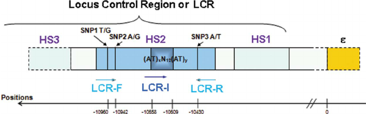

# Cis-Regulatory Elements (CREs)

## 1. What are Cis-Regulatory Elements?

**Cis-Regulatory Elements (CREs)** or **cis-regulatory modules (CRMs)**
are **non-coding DNA sequences** that control **when, where, and how
much a gene is expressed**. Unlike protein-coding sequences, CREs do not
produce proteins but instead function as **“molecular switches”** that
regulate gene activity.

These elements are called **“cis”** because they are located **on the
same chromosome as the genes they regulate**. They function by
interacting with **transcription factors (TFs)**, **chromatin
remodelers**, and **RNA polymerase** to either activate or repress
transcription. A single TFs may control the expression of many genes
(**pleiotropy**) via binding many CREs. CREs contrast with **trans
regulatory elements**.

Figure 1: Organization of a eukaryotic protein-coding gene region

[Image
Credit](https://www.mun.ca/biology/scarr/Organization_of_a_eukaryotic_gene.html)

CREs are one of several types of functional **regulatory elements**.
**Regulatory elements are binding site of TFs** which involved in gene
regulation. **Histone modification** and/or **DNA methylation** also
play a significant role in transcription. **Non-coding RNAs (ncRNAs)**
such as **microRNAs (miRNAs)** also control gene activity
**post-transcriptionally**. TFs are proteins that bind to specific DNA
sequences within regulatory regions, controlling the transcription rate
of associated genes.

Figure 2: Regulatory Regions in Human Genome

## 2. Types of Cis-Regulatory Elements & Their Examples

CREs can be classified into different types based on their function and
location:

<table>
<colgroup>
<col style="width: 25%" />
<col style="width: 25%" />
<col style="width: 25%" />
<col style="width: 25%" />
</colgroup>
<thead>
<tr class="header">
<th style="text-align: left;">Type</th>
<th style="text-align: left;">Function</th>
<th style="text-align: left;">Location</th>
<th style="text-align: left;">Examples</th>
</tr>
</thead>
<tbody>
<tr class="odd">
<td style="text-align: left;"><strong>Promoters</strong></td>
<td style="text-align: left;">Initiate transcription by recruiting RNA
polymerase</td>
<td style="text-align: left;">Directly upstream of the gene (~100-1000
bp)</td>
<td style="text-align: left;"><strong>TATA Box, GC Box, CAAT
Box</strong></td>
</tr>
<tr class="even">
<td style="text-align: left;"><strong>Enhancer</strong></td>
<td style="text-align: left;">Increase transcription by binding
activator proteins</td>
<td style="text-align: left;">Can be far upstream/downstream or in
introns (~10-1000 kb away)</td>
<td style="text-align: left;"><strong>SHH limb enhancer (ZRS), MYC
super-enhancer</strong></td>
</tr>
<tr class="odd">
<td style="text-align: left;"><strong>Silencers</strong></td>
<td style="text-align: left;">Decrease transcription by recruiting
repressor proteins</td>
<td style="text-align: left;">Near or far from the gene, similar to
enhancers</td>
<td style="text-align: left;"><strong>Neuron-Restrictive Silencer
Element (NRSE)</strong></td>
</tr>
<tr class="even">
<td style="text-align: left;"><strong>Insulators</strong></td>
<td style="text-align: left;">Block enhancer-promoter interactions to
prevent inappropriate gene activation</td>
<td style="text-align: left;">Between enhancers and promoters</td>
<td style="text-align: left;"><strong>CTCF-binding sites</strong></td>
</tr>
<tr class="odd">
<td style="text-align: left;"><strong>Locus Control Regions
(LCRs)</strong></td>
<td style="text-align: left;">Regulate multiple genes in a cluster by
coordinating their expression</td>
<td style="text-align: left;">Upstream of gene clusters</td>
<td style="text-align: left;"><strong>β-globin LCR</strong></td>
</tr>
</tbody>
</table>

## 3. Examples of Cis-Regulatory Elements

### A. Promoters (Essential for Transcription Initiation)

-   A **promoter** is a DNA sequence where proteins, known as TFs, bind
    to initiate the transcription of a single RNA transcript from the
    DNA downstream of the promoter.

-   Found near the **transcriptional start site (TSS) immediately
    upstream** of a gene (towards the **5\` region** of the **sense
    strand**). TFs are involved in the formation the transcriptional
    complex.

-   Contain specific **motifs** such as **response elements** that
    provide secure binding site for **RNA polymerase and transcription
    factors**.

-   Can be 100-1000 base pairs long, depends on the gene and product of
    transcription.

-   Examples:

    -   **TATA Box**: A common core promoter element (~25-30 bp upstream
        of TSS).
    -   **GC Box (GGGCGG)**: Found in housekeeping genes.
    -   **CAAT Box**: Found in many eukaryotic genes.

The promoter region is divided into three main components:

#### 1. Core Promoter:

This is the essential region located near the transcription start site,
where general transcription factors and RNA polymerase bind to initiate
transcription. It typically contains conserved elements like the TATA
box or initiator sequences.

#### 2. Proximal Promoter:

Positioned just upstream of the core promoter, the proximal promoter
contains binding sites for specific transcription factors that enhance
or repress transcription. These sites are usually within a few hundred
base pairs of the transcription start site.

#### 3. Distal Promoter:

Located further upstream or even downstream from the gene, distal
promoter elements can be several kilobases away from the transcription
start site. They include enhancers and silencers, which interact with
transcription factors to modulate gene expression over long distances.

Together, these promoter components coordinate the precise regulation of
gene transcription.

Figure 3: Promoters: A generalized promoter of a gene transcribed by RNA
polymerase II is shown. Transcription factors recognize the promoter.
RNA polymerase II then binds and forms the transcription initiation
complex.

[Image Credit](https://www.cs.ucf.edu/~xiaoman/ET/)

Within the promoter region, just upstream of the transcription start
site, lies the **TATA box**, a sequence consisting of repeated thymine
and adenine nucleotides (TATA repeats). This region plays a crucial role
in transcription initiation by serving as a binding site for the
**transcription factor TFIID**, which is the first to recognize and
attach to the TATA box. The binding of TFIID recruits additional
transcription factors, including **TFIIB, TFIIE, TFIIF, and TFIIH**,
forming the **transcription initiation complex**. Once this complex is
assembled, **RNA polymerase** binds upstream of the TATA box.
Phosphorylation of RNA polymerase within this complex leads to
conformational changes, activating the transcription initiation process
and positioning the polymerase correctly to begin transcription.
Additionally, a **DNA-bending protein** helps bring distant enhancers
into proximity with the transcription factors and mediator proteins,
facilitating transcription regulation.

Beyond the **general transcription factors**, other **sequence-specific
transcription factors** bind to promoter regions to regulate gene
expression. Unlike general transcription factors, which function at all
promoters, these regulators interact with specific promoter sequences to
control the transcription of particular genes. In the genome, there are
**hundreds of transcription factors**, each recognizing a unique DNA
sequence motif.

When these transcription factors bind to promoter regions just upstream
of a gene on the same chromosome, they are known as **cis-acting
elements**. The specific region where a transcription factor binds is
called the **transcription factor binding site**. These transcription
factors respond to **environmental cues**, directing them to their
binding sites and enabling the transcription of genes required under
specific conditions.

### B. Enhancers (Boost Gene Expression)

Enhancers are CREs that play a crucial role in controlling gene
expression by increasing the transcriptional activity of specific genes.
Unlike promoters, which are generally located immediately upstream of a
gene, **enhancers can be located at variable distances**, often
**kilobases away from the gene they regulate**, either **upstream,
downstream**, or **within intronic regions**. They can even be found on
different chromosomes in some cases due to **chromatin looping**.

Figure 4: Promoter Enhancer Interaction

[Image Credit](https://www.cs.ucf.edu/~xiaoman/ET/)

#### Key Characteristics of Enhancers

#### 1. Distance-Independent Function

-   Unlike promoters, enhancers do not need to be adjacent to the
    transcription start site (TSS). They can be located far away and
    still regulate gene transcription through DNA looping, which brings
    them in contact with the target gene.

#### 2. Orientation Independence

-   Enhancers can function in **either orientation** (forward or
    reverse) without affecting their regulatory activity.

#### 3. Tissue-Specific & Temporal Control

-   Enhancer activity is highly **cell-type specific** and varies
    depending on **developmental stage, cell signaling**, and
    **environmental stimuli**.

#### 4. Mediators of Transcription Factor Binding

-   Enhancers contain multiple **TFBSs**. Transcription factors binding
    to enhancers recruit **coactivators**, including **mediator
    complexes**, **chromatin remodelers**, and **histone-modifying
    enzymes**, to promote transcription.

#### 5. Chromatin Accessibility and Modifications

-   Enhancers are often marked by **histone modifications**, such as:

    -   **H3K4me1** (monomethylation of histone H3 lysine 4)
    -   **H3K27ac** (acetylation of histone H3 lysine 27), which
        distinguishes active enhancers.

-   **DNAse I hypersensitivity** also indicates open chromatin regions
    where enhancers are accessible for transcription factor binding.

#### 6. Enhancer-Promoter Interaction via Chromatin Looping

-   Enhancers interact with promoters through **chromatin looping**,
    facilitated by proteins like **cohesin** and **CTCF (CCCTC-binding
    factor)**, bringing them into spatial proximity despite physical
    distance on the linear genome.

#### 7. Super-Enhancers

-   Clusters of enhancers that drive exceptionally high levels of
    transcription for key genes (often in cell identity and disease
    contexts) are termed **super-enhancers**.

#### Examples:

-   **SHH Limb Enhancer (ZRS)** → Regulates **Sonic Hedgehog (SHH)**
    gene, controlling limb development. Mutations cause polydactyly.
-   **MYC Super-Enhancer** → Drives **high expression of MYC**, a key
    oncogene in cancer.

#### Mechanism of Enhancer Function

#### 1. Transcription Factor Recruitment

-   Specific transcription factors bind to enhancer sequences,
    recruiting coactivator complexes such as **Mediator, p300, CBP**,
    and **chromatin remodelers**.

#### 2. Mediator Complex Assembly

-   The **mediator complex** bridges enhancer-bound transcription
    factors and the basal transcription machinery at the promoter.

#### 3. Histone Modifications and Chromatin Remodeling

-   Histone acetylation and methylation open chromatin for transcription
    machinery access.

#### 4. DNA Looping Brings Enhancer to Promoter

-   Proteins like **CTCF** and **Cohesin** mediate the formation of
    **chromatin loops**, physically bringing enhancers and promoters
    into close proximity.

#### 5. Activation of RNA Polymerase II and Transcription Initiation

-   RNA polymerase II is recruited and activated, allowing transcription
    to begin.

#### Examples of Enhancer Function

#### 1.β-Globin Locus Control Region (LCR)

#### 1. The **β-globin gene cluster** is regulated by an **upstream enhancer**, known as the **locus control region (LCR)**, which ensures high expression of β-globin in erythroid cells.

#### 2. SHH (Sonic Hedgehog) Enhancer in Limb Development

-   The **ZRS (ZPA regulatory sequence)** is an enhancer that regulates
    **Sonic Hedgehog (SHH)** gene expression in limb development.
    Mutations in this enhancer lead to **limb malformations**.

#### 3. MYC Super-Enhancer in Cancer

-   The oncogene **MYC** is controlled by a **super-enhancer**, which
    drives its high expression in cancer. Targeting MYC enhancers has
    been explored as a potential cancer therapy.

### C. Silencers (Repress Gene Expression)

Silencers inhibit gene transcription by preventing or reducing RNA
polymerase activity. They function oppositely to enhancers by
**repressing gene expression** when specific transcription factors or
repressor proteins bind to them. Silencers can be located **upstream,
downstream, within introns, or even at a distance** from the target
gene.

Figure 5: Promoter Silencer Interaction

[Image Credit](https://www.cs.ucf.edu/~xiaoman/ET/)

#### Types of Silencers

Silencers can be classified based on their mechanisms of action:

#### 1. Constitutive Silencers

-   These silencers are **always active** and continuously repress
    transcription regardless of cellular conditions.
-   Example: **Heterochromatin regions**, such as those containing
    transposable elements, often harbor constitutive silencers to
    maintain gene repression.

#### 2. Conditional Silencers

-   These silencers function **only under specific conditions**, such as
    in response to developmental signals or environmental changes.
-   Example: A silencer may be active in one cell type but inactive in
    another due to the availability of specific repressor proteins.

#### Key Characteristics of Silencers

#### 1. Location Flexibility

-   Silencers can be **upstream or downstream** of the target gene,
    **within introns**, or even **far from the TSS**.

#### 2. Orientation Independence

-   Similar to enhancers, silencers can function in **either direction**
    (forward or reverse).

#### 3. Transcription Factor Binding

-   Silencers contain **binding sites for repressor proteins**, which
    interact with general transcription machinery to **block RNA
    polymerase recruitment or elongation**.

#### 4. Chromatin Remodeling and Histone Modifications

-   Silencers are often marked by **histone modifications**, such as:
    -   **H3K9me3** (trimethylation of histone H3 at lysine 9)
    -   **H3K27me3** (trimethylation of histone H3 at lysine 27), which
        are associated with transcriptional repression.
-   These marks recruit chromatin remodelers such as heterochromatin
    protein 1 (HP1), which condenses chromatin and prevents
    transcription.

#### 5. Silencer-Promoter Interaction via DNA Looping

-   Similar to enhancers, silencers can interact with promoters through
    **chromatin looping**, facilitated by proteins like **CTCF and
    cohesin**. This looping allows silencers to exert their repressive
    effects from a distance.

#### 6. Recruitment of Corepressor Complexes

-   Repressors binding to silencers can **recruit corepressors**, such
    as:
    -   **SIN3A**, a scaffold protein that recruits histone deacetylases
        (HDACs)
    -   **NCOR (Nuclear receptor corepressor)**, which helps shut down
        transcription

#### Mechanisms of Silencer Function

#### 1. Direct Transcriptional Repression

-   Repressor proteins bind to the silencer, **blocking RNA polymerase
    II** from binding to the promoter.

#### 2. Histone Modification and Chromatin Condensation

-   Silencers **recruit histone deacetylases (HDACs)**, leading to
    histone deacetylation and chromatin compaction, making DNA
    inaccessible to transcription machinery.

#### 3. Interference with Enhancer-Promoter Communication

-   Silencers can **disrupt enhancer activity** by blocking
    transcription factor binding or **preventing chromatin looping**.

#### 4. RNA Polymerase Stalling

-   Some silencers cause **RNA polymerase pausing or stalling**,
    preventing elongation and halting transcription.

#### Examples of Silencer Function

#### 1. NRSE/RE-1 (Neuron-Restrictive Silencer Element)

-   This silencer prevents non-neuronal genes from being expressed in
    neurons.
-   It binds to **REST (RE1-Silencing Transcription Factor)**, which
    recruits corepressors like HDACs.

#### 2. SILENCER ELEMENT IN THE β-GLOBIN GENE

-   The **β-globin gene locus** has a silencer that ensures
    **stage-specific expression** of hemoglobin genes.

#### 3. X-Chromosome Inactivation (XCI) via Xist RNA

-   The **X-inactive specific transcript (Xist)** RNA recruits chromatin
    modifiers to silence one X chromosome in female cells.

#### 4. Cancer-Associated Silencer Elements

-   Some tumor suppressor genes (e.g., **p16INK4A**) are silenced in
    cancer through **DNA methylation at silencer regions**.

### D. Insulators (Block Incorrect Enhancer-Promoter Interactions)

**Insulators** function as genetic boundaries, **blocking or directing
interactions between enhancers, silencers, and promoters**. These
sequences prevent unintended gene activation or repression by ensuring
that regulatory elements influence only their specific target genes.

#### Functions of Insulators

Insulators perform two primary functions in gene regulation:

Figure 6: Insulators as enhancer blocking activity and barrier function

[Image
Credit](https://www.sciencedirect.com/science/article/abs/pii/S0168952514000535)

#### 1. Enhancer-Blocking Activity

-   Insulators **prevent enhancers from activating unintended genes** by
    acting as a physical boundary between enhancers and promoters.
-   Example: In the **β-globin gene cluster**, insulators prevent
    enhancers from activating nearby non-erythroid genes.

#### 2. Barrier Function

-   Insulators **protect genes from heterochromatin spread**, ensuring
    that active genes remain transcriptionally accessible.
-   Example: In yeast, insulators prevent heterochromatin from silencing
    active genes.

#### Key Characteristics of Insulators

#### 1. Location Flexibility

-   Insulators are **position-dependent**—they function only when placed
    between enhancers/silencers and promoters.

#### 2. Orientation Independence

-   Unlike enhancers and silencers, **insulators work in only one
    direction**, typically **blocking elements located upstream** from
    acting on downstream genes.

#### 3. Chromatin Architectural Proteins

-   Insulators **bind specific proteins**, such as **CTCF (CCCTC-binding
    factor)** and **cohesin**, to mediate their function.

#### 4. Chromatin Looping and Domain Formation

-   Insulators help **organize the genome into topologically associating
    domains (TADs)** by **establishing chromatin loops** that separate
    regulatory elements.

#### 5. Tissue-Specific Function

-   Some insulators work **only in specific cell types**, depending on
    whether **insulator-binding proteins** are present.

#### Mechanisms of Insulator Function

#### 1. Blocking Enhancer-Promoter Interaction

-   Insulators **prevent enhancers from activating the wrong promoters**
    by interfering with chromatin looping.

#### 2. Recruits CTCF and Cohesin

-   **CTCF (CCCTC-binding factor)** is the **key insulator-binding
    protein** that organizes chromatin architecture.
-   **Cohesin**, a ring-like protein complex, **helps form chromatin
    loops** that restrict enhancer action.

#### 3. Histone Modifications and Nucleosome Positioning

-   Insulators **modify chromatin structure**, marking them as genetic
    boundaries.

#### 4. TAD Formation

-   Insulators **create topologically associating domains (TADs)**,
    where regulatory elements interact only with genes within the same
    TAD.

#### Examples of Insulator Function

#### 1. The Igf2/H19 Locus and CTCF

-   **In mammals**, the **Igf2** and **H19** genes share an enhancer,
    but an **insulator prevents Igf2** activation in certain cells by
    recruiting **CTCF**.

#### 2. β-Globin Locus Control Region (LCR)

-   Insulators at the β-globin locus ensure that the **LCR enhancer
    activates only globin genes**, preventing activation of nearby
    genes.

#### 3. Drosophila gypsy Insulator

-   The **gypsy insulator in Drosophila** is one of the
    best-characterized insulators, binding to the **Su(Hw) protein** to
    block enhancer activity.

#### 4. X-Chromosome Inactivation (XCI)

-   Insulators **partition active and inactive regions** of the X
    chromosome during **X-chromosome inactivation** in female mammals.

### E. Locus Control Regions

**A Locus Control Region (LCR)** plays a crucial role in regulating the
**high-level, tissue-specific, and temporal expression** of genes within
a genomic locus. LCRs function over long distances by **enhancing gene
transcription**, ensuring the proper activation and repression of genes
during development and differentiation.

LCRs are particularly important in **gene clusters**, such as the
**β-globin gene cluster**, where they help orchestrate stage-specific
gene expression.

Figure 7: The β -LCR-HS2 region showing the positions of the three SNPs
and the microsatellite motif (AT) X N 12 (AT) Y .

[Image
Credit](https://www.researchgate.net/figure/The-b-LCR-HS2-region-showing-the-positions-of-the-three-SNPs-and-the-microsatellite_fig1_232717676)

#### Key Characteristics of LCRs

#### 1. Long-Distance Regulation

-   LCRs function over kilobases (kb) away from the genes they regulate
    by interacting with enhancers, promoters, and chromatin architecture
    proteins.

#### 2. Tissue-Specific and Developmental Regulation

-   LCRs ensure that genes are expressed **only in specific cell types**
    and at the **correct developmental stage**.
-   Example: The **β-globin LCR** activates different globin genes at
    different developmental stages.

#### 3. Multiple Regulatory Elements

-   LCRs **contain multiple DNase I hypersensitive sites (DHSs)**, which
    are **regions of open chromatin** accessible to transcription
    factors.
-   Each DHS site recruits specific transcription factors, which work
    together to **enhance gene expression**.

#### 4. Histone Modifications and Chromatin Remodeling

-   LCRs are marked by **active histone modifications**, such as:
    -   H3K4me1 (monomethylation of histone H3 at lysine 4)
    -   H3K27ac (acetylation of histone H3 at lysine 27), associated
        with enhancer activity.
-   LCRs recruit chromatin remodelers, making the chromatin more
    accessible to transcription machinery.

#### 5. Chromatin Looping and Enhancer-Promoter Interaction

-   LCRs **bring enhancers into proximity with target promoters**
    through **chromatin looping**, facilitated by proteins like **CTCF**
    and **Cohesin**.
-   This ensures that genes in the locus are expressed at the right time
    and in the right cell type.

#### Mechanism of LCR Function

#### 1. Recruitment of Transcription Factors

-   LCRs recruit TFs to specific **DNase I hypersensitive sites**,
    allowing controlled activation of gene expression.

#### 2. Formation of Chromatin Loops

-   LCRs interact with promoters via **chromatin looping**, allowing
    \*\*RNA polymerase II\* and coactivators to efficiently initiate
    transcription.

#### 3. Histone Acetylation and Chromatin Remodeling

-   LCRs recruit histone acetyltransferases (HATs) and chromatin
    remodelers, ensuring an open chromatin conformation conducive to
    transcription.

#### 4. Dynamic Gene Activation

-   LCRs regulate **sequential activation of genes** within a locus
    based on **developmental timing** and **cell-type specificity**.

#### Examples of LCR Function

#### 1. β-Globin Locus Control Region (LCR)

-   One of the best-studied LCRs is the **β-globin LCR**, which
    regulates **globin gene expression** in erythroid cells.
-   The β-globin gene cluster contains multiple **globin genes**, each
    expressed at different **developmental stages**:
    -   **Embryonic stage**: ε-globin
    -   **Fetal stage**: γ-globin
    -   **Adult stage**: δ- and β-globin
-   The β-globin LCR, located **~50 kb upstream of the gene cluster**,
    ensures **proper temporal and spatial expression** of these genes.
-   It contains \***five DNase I hypersensitive sites (HS1-HS5)** that
    coordinate enhancer-like activity.

#### 2. Hox Gene Regulation by LCR

-   The **Hox gene clusters**, which control **body patterning during
    development**, are regulated by LCR-like elements that ensure
    correct **spatial and temporal activation** of different **Hox
    genes**.

#### 3. Growth Hormone (GH) Gene LCR

-   An LCR upstream of the **growth hormone (GH) gene** regulates
    **tissue-specific expression in the pituitary gland**.

#### 4. Th2 Cytokine LCR

-   An LCR in the **Th2 cytokine locus** regulates expression of **IL-4,
    IL-5, and IL-13**, which are essential for immune response.

## 4. How Cis-Regulatory Elements Work Together

A gene’s expression is **not controlled by just one CRE** but by a
**network of multiple elements** working in coordination.

For example, **in development**:

-   The **SHH gene** is activated in specific tissues by a **distant
    enhancer (ZRS)**.

-   Its **promoter** ensures transcription starts correctly.

-   **Insulators** prevent unwanted activation in other tissues.

-   If **silencers** are mutated, the gene could be **expressed in the
    wrong location**.

## 5. Methods to Identify and Study Cis-Regulatory Elements

<table>
<colgroup>
<col style="width: 50%" />
<col style="width: 50%" />
</colgroup>
<thead>
<tr class="header">
<th style="text-align: left;">Method</th>
<th style="text-align: left;">Purpose</th>
</tr>
</thead>
<tbody>
<tr class="odd">
<td style="text-align: left;"><strong>ChIP-seq (Chromatin
Immunoprecipitation Sequencing)</strong></td>
<td style="text-align: left;">Identifies <strong>transcription factor
binding sites</strong> on CREs.</td>
</tr>
<tr class="even">
<td style="text-align: left;"><strong>ATAC-seq (Assay for
Transposase-Accessible Chromatin Sequencing)</strong></td>
<td style="text-align: left;">Maps<strong>open chromatin
regions</strong> where CREs are active.</td>
</tr>
<tr class="odd">
<td style="text-align: left;"><strong>Hi-C / Capture-C</strong></td>
<td style="text-align: left;">Detects <strong>3D chromatin
interactions</strong> between enhancers and promoters.</td>
</tr>
<tr class="even">
<td style="text-align: left;"><strong>CRISPRi (CRISPR
Interference)</strong></td>
<td style="text-align: left;">Silences CREs to test their function.</td>
</tr>
<tr class="odd">
<td style="text-align: left;"><strong>eQTL (Expression Quantitative
Trait Loci) Analysis</strong></td>
<td style="text-align: left;">Links <strong>CRE variants to gene
expression changes</strong>.</td>
</tr>
</tbody>
</table>

## 6. Role of Cis-Regulatory Elements in Disease

Since **CREs control gene expression**, mutations in them can cause
**disease** by:

-   Activating oncogenes (cancer).
-   Disrupting developmental genes (congenital disorders).
-   Affecting brain gene expression (neurological disorders).

**Examples of CRE-Related Diseases**

<table>
<colgroup>
<col style="width: 33%" />
<col style="width: 33%" />
<col style="width: 33%" />
</colgroup>
<thead>
<tr class="header">
<th style="text-align: left;">Disease</th>
<th style="text-align: left;">CRE Affected</th>
<th style="text-align: left;">Effect</th>
</tr>
</thead>
<tbody>
<tr class="odd">
<td style="text-align: left;"><strong>Cancer (Melanoma)</strong></td>
<td style="text-align: left;">TERT Promoter Mutation</td>
<td style="text-align: left;">Increases telomerase expression →
uncontrolled cell division</td>
</tr>
<tr class="even">
<td style="text-align: left;"><strong>Polydactyly</strong></td>
<td style="text-align: left;">SHH Limb Enhancer Mutation (ZRS)</td>
<td style="text-align: left;">Misexpression of SHH → extra
fingers/toes.</td>
</tr>
<tr class="odd">
<td style="text-align: left;"><strong>Thalassemia</strong></td>
<td style="text-align: left;">β-Globin LCR Mutation</td>
<td style="text-align: left;">Disrupts hemoglobin expression → severe
anemia.</td>
</tr>
<tr class="even">
<td style="text-align: left;"><strong>Autism Spectrum Disorder
(ASD)</strong></td>
<td style="text-align: left;">NRXN1 Enhancer Mutation</td>
<td style="text-align: left;">Affects neuronal gene expression →
neurodevelopmental issues.</td>
</tr>
</tbody>
</table>

### Key Differences Between Cis- and Trans-Regulatory Elements

<table>
<colgroup>
<col style="width: 33%" />
<col style="width: 33%" />
<col style="width: 33%" />
</colgroup>
<thead>
<tr class="header">
<th style="text-align: left;">Feature</th>
<th style="text-align: left;">CREs</th>
<th style="text-align: left;">TREs</th>
</tr>
</thead>
<tbody>
<tr class="odd">
<td style="text-align: left;"><strong>Location</strong></td>
<td style="text-align: left;">Near the traget gene</td>
<td style="text-align: left;">Can be anywhere in the genome</td>
</tr>
<tr class="even">
<td style="text-align: left;"><strong>Function</strong></td>
<td style="text-align: left;">Binding sites for regulators</td>
<td style="text-align: left;">Encode proteins/RNAs that regulate
genes</td>
</tr>
<tr class="odd">
<td style="text-align: left;"><strong>Mobility</strong></td>
<td style="text-align: left;">Fixed in the DNA sequence</td>
<td style="text-align: left;">Diffusible molecules</td>
</tr>
<tr class="even">
<td style="text-align: left;"><strong>Examples</strong></td>
<td style="text-align: left;">Promoters, enhancers, silencers</td>
<td style="text-align: left;">Transcription factors, miRNAs,
repressors</td>
</tr>
<tr class="odd">
<td style="text-align: left;"><strong>Regulation</strong></td>
<td style="text-align: left;">Affects only nearby genes</td>
<td style="text-align: left;">Can regulate multiple genes</td>
</tr>
</tbody>
</table>

### 7. Conclusion

-   **Cis-regulatory elements** are critical for gene expression and
    influence development, cell identity, and disease.
-   They include **promoters, enhancers, silencers, insulators, and
    LCRs**.
-   **Mutations in these regions can cause severe genetic diseases**.
-   **Advanced sequencing and genome-editing tools** (e.g., **ChIP-seq,
    CRISPR, Hi-C**) help uncover their functions.

### Reference:

#### 1. Alberts, B., Johnson, A., Lewis, J., Raff, M., Roberts, K., & Walter, P. (2015). Molecular Biology of the Cell (6th ed.). Garland Science.

#### 2. Lodish, H., Berk, A., Kaiser, C. A., Krieger, M., Bretscher, A., Ploegh, H., Amon, A., & Scott, M. P. (2021). Molecular Cell Biology (9th ed.). W.H. Freeman.

#### 3. Lewin, B. (2018). Genes XII. Jones & Bartlett Learning.

#### 4. Thomas, M. C., & Chiang, C. M. (2006). The general transcription machinery and general cofactors. Critical Reviews in Biochemistry and Molecular Biology, 41(3), 105–178.

#### 5. Plank, J. L., & Dean, A. (2014). Enhancer function: Mechanistic and genome-wide insights come together. Molecular Cell, 55(1), 5-14.

#### 6. Whyte, W. A., Orlando, D. A., Hnisz, D., et al. (2013). Master transcription factors and mediator establish super-enhancers at key cell identity genes. Cell, 153(2), 307-319.

#### 7. Catarino, R. R., & Stark, A. (2018). Assessing enhancer function in genome-wide studies. Nature Reviews Genetics, 19(7), 428-443.

#### 8. Long, H. K., Prescott, S. L., & Wysocka, J. (2016). Ever-changing landscapes: Transcriptional enhancers in development and evolution. Cell, 167(5), 1170-1187.

#### 9. Ogbourne, S., & Antalis, T. M. (1998). Transcriptional control and the role of silencers in transcriptional regulation in eukaryotes. Biochemical Journal, 331(1), 1-14.

#### 10. Krogan, N. J., Keogh, M. C., Datta, N., Sawa, C., Ryan, O. W., Ding, H., … Greenblatt, J. F. (2003). A Snf2 family ATPase complex required for transcriptional repression at silencers and heterochromatic regions. Molecular Cell, 12(6), 1467-1476.

#### 11. Jenuwein, T., & Allis, C. D. (2001). Translating the histone code. Science, 293(5532), 1074-1080.

#### 12. Klose, R. J., & Bird, A. P. (2006). Genomic DNA methylation: The mark and its mediators. Trends in Biochemical Sciences, 31(2), 89-97.

#### 13. Phillips, J. E., & Corces, V. G. (2009). CTCF: Master weaver of the genome. Cell, 137(7), 1194-1211.

#### 14. Hnisz, D., Day, D. S., & Young, R. A. (2016). Insulated neighborhoods: Structural and functional units of mammalian gene control. Cell, 167(5), 1188-1200.

#### 15. Dixon, J. R., Selvaraj, S., Yue, F., Kim, A., Li, Y., Shen, Y., … & Ren, B. (2012). Topological domains in mammalian genomes identified by Hi-C. Nature, 485(7398), 376-380.

#### 16. Bell, A. C., West, A. G., & Felsenfeld, G. (2001). Insulators and boundaries: Versatile regulatory elements in the eukaryotic genome. Science, 291(5503), 447-450.

[⬅ Back to Home](../index.md)
