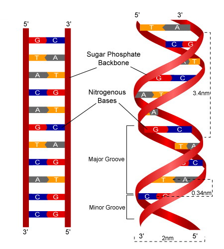

# DNA (Deoxyribonucleic Acid)

## Introduction

DNA is the hereditary material in almost all living organisms. It
carries genetic instructions for growth, development, functioning, and
reproduction. It is a long molecule made up of nucleotides, forming a
double helix structure.

## History of DNA Discovery

### 1. Early Theories of Heredity

Before DNA was identified as the genetic material, scientists believed
proteins carried genetic information due to their complexity.

### 2. Key Discoveries

-   **1869 - Friedrich Miescher**: Isolated a substance from white blood
    cells, called “nuclein,” later identified as DNA.
-   **1928 - Frederick Griffith**: Conducted experiments with bacteria
    (Streptococcus pneumoniae) and discovered the **“transforming
    principle.”**
-   **1944 - Oswald Avery, Colin MacLeod, and Maclyn McCarty**:
    Identified DNA as the transforming principle.
-   **1952 - Hershey & Chase Experiment**: Used bacteriophages to
    confirm that DNA (not proteins) is the genetic material.
-   **1953 - James Watson & Francis Crick (with contributions from
    Rosalind Franklin and Maurice Wilkins)**: Discovered the
    **double-helix** structure of DNA.
-   **1961 - Marshall Nirenberg and Heinrich Matthaei**: Cracked the
    genetic code and discovered how DNA directs protein synthesis.

## Structure of DNA

DNA has a **double-helix structure**, resembling a twisted ladder. The
**building blocks** of DNA are nucleotides, which consist of:

Figure 1: Structure of DNA

[Image
Credit](https://www2.nau.edu/lrm22/lessons/dna_notes/dna_notes.html)

#### 1. A phosphate group

#### 2. A deoxyribose sugar (pentose sugar)

#### 3. A nitrogenous base

### Nitrogenous Bases

There are **four** nitrogenous bases:

1.  Adenine (A)
2.  Thymine (T)
3.  Guanine (G)
4.  Cytosine (C)

### Base Pairing Rule (Chargaff’s Rule)

-   Adenine (A) pairs with Thymine (T) → A=T (2 hydrogen bonds)0
-   Guanine (G) pairs with Cytosine (C) → G≡C (3 hydrogen bonds)

### DNA Double Helix Features

-   **Backbone**: Made of alternating sugar and phosphate molecules.
-   **Base Pairs**: Form the rungs of the ladder.
-   **Antiparallel Strands**: One strand runs **5’ to 3’**, and the
    other runs **3’ to 5’**.

### Function of DNA

-   **Stores Genetic Information**: Carries instructions for protein
    synthesis.
-   **Replication**: Copies itself before cell division.
-   **Mutation & Evolution**: Changes in DNA lead to genetic diversity.
-   **Gene Expression**: Controls when and how genes are turned on or
    off.

## Types of DNA

DNA can be classified based on its structure, location, and function.

### 1. Based on Structure

DNA exists in **three main structural forms**:

#### A-DNA (Right-Handed Helix)

-   Found in dehydrated conditions.
-   Shorter and wider than B-DNA.
-   Rarely occurs in living cells.

#### B-DNA (Right-Handed Helix)

-   Most common form in living cells.
-   Discovered by Watson and Crick.
-   Has a major groove and minor groove for protein interactions.

#### Z-DNA (Left-Handed Helix)

-   Zigzag backbone structure.
-   Found in regions of DNA undergoing transcription.
-   May play a role in gene regulation.

### 2. Based on Location in Cells

DNA is found in different organelles:

#### Nuclear DNA (nDNA)

-   Located in the **nucleus** of eukaryotic cells.
-   Inherited from both parents.
-   Encodes most of the genetic information.

#### Mitochondrial DNA (mtDNA)

-   Found in mitochondria.
-   Circular and maternally inherited.
-   Plays a crucial role in energy production.

#### Chloroplast DNA (cpDNA)

-   Found in chloroplasts of plant cells. \*Encodes proteins for
    photosynthesis.

### 3. Based on Function

#### Coding DNA

-   Contains genes that are transcribed into RNA.
-   Only 1-2% of the human genome is coding DNA.

#### Non-Coding DNA

-   Does not code for proteins but has regulatory roles.
-   Includes **introns, regulatory elements, and repetitive DNA**.

### 4. Based on Organization in the Genome

#### Single-Copy DNA

-   Unique sequences that occur once in the genome.
-   Includes protein-coding genes.

#### Repetitive DNA

-   Sequences repeated many times.
-   Examples:
    -   **Tandem repeats** (e.g., microsatellites, minisatellites).
    -   **Interspersed repeats** (e.g., transposable elements).

### References

-   Watson, J. D., & Crick, F. H. (1953). Molecular structure of nucleic
    acids: A structure for deoxyribose nucleic acid. Nature, 171(4356),
    737-738. DOI: 10.1038/171737a0
-   Alberts, B., Johnson, A., Lewis, J., Raff, M., Roberts, K., &
    Walter, P. (2002). Molecular Biology of the Cell. 4th edition. New
    York: Garland Science.
-   Lodish, H., Berk, A., Zipursky, S. L., et al. (2000). Molecular Cell
    Biology. 4th edition. W. H. Freeman.
-   Brown, T. A. (2002). Genomes. 2nd edition. Oxford: Wiley-Liss.

[⬅ Back to Home](../index.md)
