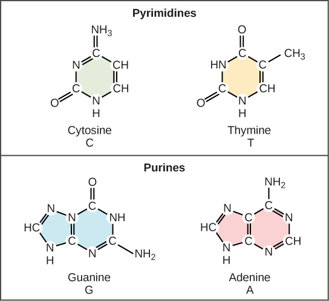
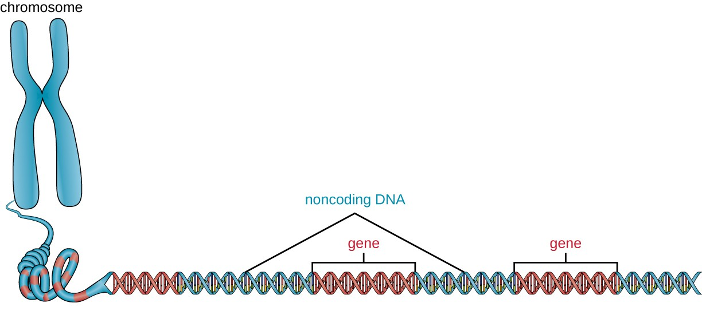

# DNA (Deoxyribonucleic Acid)

## Introduction

DNA (**Deoxyribonucleic Acid**) is the **fundamental hereditary
material** found in almost all living organisms, including animals,
plants, bacteria, and viruses. It carries the **genetic instructions**
required for the growth, development, functioning, and reproduction of
cells. DNA is a **complex biomolecule** composed of **nucleotides**,
which serve as the building blocks of life. These nucleotides are
arranged in a precise sequence to form a **double-helix structure**, a
discovery attributed to **James Watson** and **Francis Crick** in 1953,
based on Rosalind Franklin’s crucial X-ray diffraction data.

Figure 1: The Location of DNA in Human cells

[Image Credit](https://theory.labster.com/dna-location/)

DNA plays a central role in biological inheritance, ensuring that traits
are passed from one generation to the next. It serves as a **blueprint**
for the synthesis of proteins, which are essential for the structure and
function of every cell in the body. The ability of DNA to **replicate**
itself allows genetic information to be transmitted accurately during
cell division. However, occasional changes in the DNA sequence, known as
**mutations**, contribute to **genetic diversity** and evolution.The
**entire genetic content** of a cell is known as its **genome**, and the
study of genomes is **genomics**.

The structure of DNA is **highly conserved** across species, yet the
sequence of nucleotide bases within the DNA molecule determines the
**unique genetic identity** of each organism. With advancements in
genetic research, the study of DNA has led to groundbreaking discoveries
in **medicine, forensics, biotechnology, and evolutionary biology**.
From genetic engineering and gene therapy to DNA fingerprinting, our
understanding of DNA has transformed science and technology, enabling
numerous innovations in healthcare, agriculture, and forensic
investigations.

## History of DNA Discovery

### 1. Early Theories of Heredity

Before DNA was identified as the genetic material, scientists believed
proteins carried genetic information due to their complexity.

### 2. Key Discoveries

-   **1869 - Friedrich Miescher**: Isolated a substance from white blood
    cells, called “nuclein,” later identified as DNA.
-   **1928 - Frederick Griffith**: Conducted experiments with bacteria
    (Streptococcus pneumoniae) and discovered the **“transforming
    principle.”**
-   **1944 - Oswald Avery, Colin MacLeod, and Maclyn McCarty**:
    Identified DNA as the transforming principle.
-   **1952 - Hershey & Chase Experiment**: Used bacteriophages to
    confirm that DNA (not proteins) is the genetic material.
-   **1953 - James Watson & Francis Crick (with contributions from
    Rosalind Franklin and Maurice Wilkins)**: Discovered the
    **double-helix** structure of DNA.
-   **1961 - Marshall Nirenberg and Heinrich Matthaei**: Cracked the
    genetic code and discovered how DNA directs protein synthesis.

## Structure of DNA

DNA has a **double-helix structure**, resembling a twisted ladder. The
**building blocks** of DNA are nucleotides, which consist of:

Figure 2: Structure of DNA

[Image
Credit](https://www2.nau.edu/lrm22/lessons/dna_notes/dna_notes.html)

### 1. Phosphate Group

-   The **phosphate group (PO₄)** consists of **one phosphorus atom**
    bonded to **four oxygen atoms**.
-   It is **negatively charged**, making DNA an **acidic molecule**.
-   Phosphate groups are linked to **deoxyribose sugars** through
    **phosphodiester bonds**, forming the **sugar-phosphate backbone**.
-   These bonds connect the **5’ carbon** of one nucleotide’s sugar to
    the **3’ carbon** of the next nucleotide’s sugar, ensuring the
    **directionality** of the DNA strand (5’ to 3’).

#### Function:

-   Provides structural stability to the DNA strand.
-   Maintains DNA’s **negative charge**, which helps in interactions
    with proteins (e.g., histones).
-   Forms the **backbone** of the DNA molecule.

Figure 3: Nucleotides = deoxyribose + base + phosphate group

[Image
Credit](https://elearning.fondation-merieux.org/molecular-biology/chapter-1/page-8.php)

### 2. Deoxyribose Sugar

-   DNA contains a **pentose (5-carbon) sugar** called **deoxyribose**.
-   The name **deoxyribose** comes from the absence of an **oxygen
    atom** on the **2’ carbon**, distinguishing it from **ribose** in
    RNA.

#### Structure of Deoxyribose:

<table>
<colgroup>
<col style="width: 50%" />
<col style="width: 50%" />
</colgroup>
<thead>
<tr class="header">
<th style="text-align: left;">Carbon Position</th>
<th style="text-align: left;">Function</th>
</tr>
</thead>
<tbody>
<tr class="odd">
<td style="text-align: left;"><strong>1’ Carbon</strong></td>
<td style="text-align: left;">Bonds to a <strong>nitrogenous
base</strong> (A, T, G, C)</td>
</tr>
<tr class="even">
<td style="text-align: left;"><strong>2’ Carbon</strong></td>
<td style="text-align: left;">Lacks an oxygen atom (hence, “deoxy”)</td>
</tr>
<tr class="odd">
<td style="text-align: left;"><strong>3’ Carbon</strong></td>
<td style="text-align: left;">Form a <strong>phosphodiester
bond</strong> with the <strong>next nucleotide</strong></td>
</tr>
<tr class="even">
<td style="text-align: left;"><strong>5’ Carbon</strong></td>
<td style="text-align: left;">Attached to a <strong>phosphate
group</strong></td>
</tr>
</tbody>
</table>

#### Function:

-   Forms the sugar-phosphate backbone of DNA.
-   Links nucleotides together via phosphodiester bonds.
-   Supports the attachment of nitrogenous bases.

### Nitrogenous Bases

Despite being incredibly small at the molecular level, DNA carries an
enormous amount of information, encoded in a **four-letter** language
composed of **Adenine (A), Thymine (T), Guanine (G), and Cytosine (C)**.
These nitrogenous bases follow specific pairing rules (**A with T and G
with C**) to maintain the stability of the double helix. Furthermore,
DNA exists in various structural forms (B-DNA, A-DNA, Z-DNA), allowing
flexibility in biological processes such as **gene expression,
regulation, and repair**.

There are **four** nitrogenous bases classified into **two groups**:

#### A. Purines (Double-ring structure)

-   **Adenine (A)**
-   **Guanine (G)**
-   Larger, **two-ring** molecules.

#### B. Pyrimidines (Single-ring structure)

-   **Cytosine (C)**
-   **Thymine (T)**
-   Smaller, **one-ring** molecules.

Figure 4: Cytosine and Thymine are pyrimidine and Guanine and Adenine
are purines

[Image
Credit](https://opentextbc.ca/biology/chapter/9-1-the-structure-of-dna/)

### Base Pairing Rule (Chargaff’s Rule)

Chargaff’s Rule, formulated by **Erwin Chargaff** in the **1950s**,
describes the **base composition** of DNA. It consists of two key
principles:

#### 1. Base Pairing Rule (First Parity Rule)

In a **double-stranded DNA molecule**:

-   The amount of **Adenine (A)** is equal to the amount of
    **Thymine (T) → A = T**
-   The amount of **Guanine (G)** is equal to the amount of
    **Cytosine (C) → G = C**
-   This **complementary base pairing** ensures that **purines (A, G)
    and pyrimidines (T, C) pair in a 1:1 ratio**.

#### Example of Base Composition in Different Organisms

<table>
<thead>
<tr class="header">
<th style="text-align: left;">Organism</th>
<th style="text-align: left;">A(%)</th>
<th style="text-align: left;">T(%)</th>
<th style="text-align: left;">G(%)</th>
</tr>
</thead>
<tbody>
<tr class="odd">
<td style="text-align: left;">Human</td>
<td style="text-align: left;">30.9</td>
<td style="text-align: left;">29.4</td>
<td style="text-align: left;">19.9</td>
</tr>
<tr class="even">
<td style="text-align: left;">E.coli</td>
<td style="text-align: left;">24.7</td>
<td style="text-align: left;">23.6</td>
<td style="text-align: left;">26.0</td>
</tr>
<tr class="odd">
<td style="text-align: left;">Yeast</td>
<td style="text-align: left;">31.3</td>
<td style="text-align: left;">32.9</td>
<td style="text-align: left;">18.7</td>
</tr>
</tbody>
</table>

#### 2. Species Variation Rule (Second Parity Rule)

-   The total **percentage of A+T is not necessarily equal to G+C**.
-   Different species have different **A+T and G+C ratios**, leading to
    **genetic diversity**.
-   This disproved the earlier belief that DNA composition is the same
    in all organisms.

#### Significance of Chargaff’s Rule

-   **Supported Watson & Crick’s Discovery of the DNA Double Helix**
    -   The **1:1 ratio of base pairs** explained the structure of DNA.
    -   It confirmed the concept of **complementary base pairing (A-T,
        G-C)**.
-   **Provided Evidence for DNA as the Genetic Material**
    -   DNA composition varies among species but follows the same rules,
        highlighting its role in heredity.
-   **Helps in DNA Replication and Transcription**
    -   During replication, the base-pairing rule ensures accurate
        copying of genetic information.
-   **Important in Genetic Research & Forensics**
    -   DNA sequencing and fingerprinting rely on base composition
        analysis.

### DNA Double Helix Features

-   **Backbone**: Made of alternating sugar and phosphate molecules.
-   **Base Pairs**: Form the rungs of the ladder.
-   **Antiparallel Strands**: One strand runs **5’ to 3’**, and the
    other runs **3’ to 5’**.

Figure 5: Antiparallel Structure of DNA

[Image Credit](https://slideplayer.com/slide/17764629/#google_vignette)

### Function of DNA

-   **Stores Genetic Information**: Carries instructions for protein
    synthesis.
-   **Replication**: Enable complementary base pairing, ensuring
    accurate DNA replication.
-   **Mutation & Evolution**: Changes in DNA lead to genetic diversity.
-   **Gene Expression and Protein Synthesis**: Controls when and how
    genes are turned on or off.

## Types of DNA

DNA can be classified based on its structure, location, and function.

### 1. Based on Structure

DNA exists in **three main structural forms**:

#### A-DNA (Right-Handed Helix)

-   Found in dehydrated conditions.
-   Shorter and wider than B-DNA.
-   Rarely occurs in living cells.

#### B-DNA (Right-Handed Helix)

-   Most common form in living cells.
-   Discovered by Watson and Crick.
-   Has a major groove and minor groove for protein interactions.

#### Z-DNA (Left-Handed Helix)

-   Zigzag backbone structure.
-   Found in regions of DNA undergoing transcription.
-   May play a role in gene regulation.

Figure 6: Different forms of DNA

[Image
Credit](https://www.chemistryworld.com/features/more-than-a-mirror-image-left-handed-nucleic-acids/4018889.article)

### 2. Based on Location in Cells

DNA is found in different organelles:

#### Nuclear DNA (nDNA)

-   Located in the **nucleus** of eukaryotic cells.
-   Inherited from both parents.
-   Encodes most of the genetic information.

#### Mitochondrial DNA (mtDNA)

-   Found in mitochondria.
-   Circular and maternally inherited.
-   Plays a crucial role in energy production.

#### Chloroplast DNA (cpDNA)

-   Found in chloroplasts of plant cells. \*Encodes proteins for
    photosynthesis.

### 3. Based on Function

#### Coding DNA

-   Contains genes that are transcribed into RNA.
-   Only 1-2% of the human genome is coding DNA.

#### Non-Coding DNA

-   Does not code for proteins but has regulatory roles.
-   Includes **introns, regulatory elements, and repetitive DNA**.

Figure 7: Coding and Noncoding DNA

[Image
Credit](https://courses.lumenlearning.com/suny-microbiology/chapter/structure-and-function-of-cellular-genomes/)

### 4. Based on Organization in the Genome

#### Single-Copy DNA

-   Unique sequences of DNA that occur once in the genome.
-   Includes protein-coding genes, mainly found in the **exons** and are
    sited for transcription.
-   They are present in **Euchromatin** part as they are coding region.

#### Repetitive DNA

-   Sequences repeated many times. They are short in sequence.
-   They are present in **heterochromatin** and unique in different
    individuals.  
-   Examples:
    -   **Tandem repeats** (e.g., microsatellites, minisatellites).
    -   **Interspersed repeats** (e.g., transposable elements).

### Basic Differences Between DNA and RNA

There is a second nucleic acid in all cells called **ribonucleic acid**,
or **RNA**. Like DNA, RNA is a polymer of nucleotides. Fundamental
differences between DNA and RNA are: |Feature|DNA|RNA| |:—|:—|:—|
|**Sugar**|Deoxyribose (lacks oxygen at 2’ carbon)|Ribose (has oxygen at
2’ carbon)| |**Strands**|Double-stranded (mostly)|Single-stranded
(mostly)| |**Base**|Adenine (A), Thymine (T), Guanine (G), Cytosine
(C)|Adenine (A), Uracil (U), Guanine (G), Cytosine (C)|
|**Stability**|More stable due to double helix and hydrogen bonding|Less
stable, degrades faster| |**Function**|Stores and transmits genetic
information|Involved in protein synthesis (mRNA, tRNA, rRNA) and gene
regulation| |**Types**|Only one main type|Three main types (mRNA, tRNA,
rRNA)| |**Location**|Found in the nucleus (eukaryotes) and cytoplasm
(prokaryotes)|Found in the nucleus and cytoplasm|
|**Replication**|Self-replicating|Synthesized from DNA (transcription)|

Figure 8: Difference between RNA and DNA

[Image
Credit](https://opentextbc.ca/biology/chapter/9-1-the-structure-of-dna/)

### References

-   Watson, J. D., & Crick, F. H. (1953). Molecular structure of nucleic
    acids: A structure for deoxyribose nucleic acid. Nature, 171(4356),
    737-738. DOI: 10.1038/171737a0
-   Alberts, B., Johnson, A., Lewis, J., Raff, M., Roberts, K., &
    Walter, P. (2002). Molecular Biology of the Cell. 4th edition. New
    York: Garland Science.
-   Lodish, H., Berk, A., Zipursky, S. L., et al. (2000). Molecular Cell
    Biology. 4th edition. W. H. Freeman.
-   Brown, T. A. (2002). Genomes. 2nd edition. Oxford: Wiley-Liss.

[⬅ Back to Home](../index.md)
