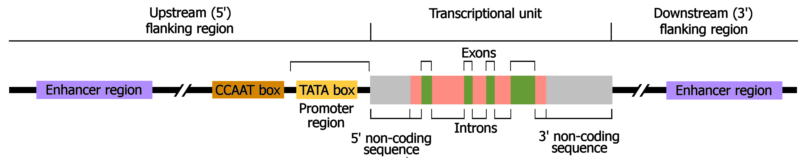
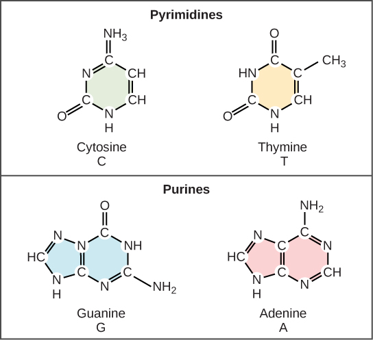
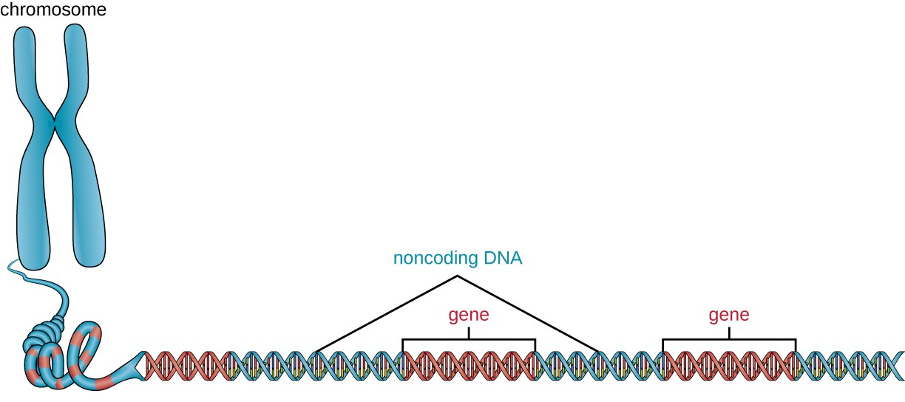

# 1. Introduction

Genes are the **fundamental units of heredity**, carrying instructions
that determine an organism’s traits. Understanding **gene structure** is
essential for exploring **genetics, evolution, gene regulation, and
disease mechanisms**.

A gene consists of both **coding (exons)** and **non-coding (introns,
regulatory elements) regions**, playing a vital role in **protein
synthesis and gene expression**. The distinction between these regions
helps scientists decode how genes function, evolve, and contribute to
health and disease.

## Definition of a gene

A **gene** is a segment of DNA that contains the instructions to produce
**a functional product**, typically a protein. However, some genes code
for **functional RNA molecules** (e.g., rRNA, tRNA, miRNA) instead of
proteins.

Figure 1: Organization of a eukaryotic protein-coding gene region

[Image
Credit](https://www.mun.ca/biology/scarr/Organization_of_a_eukaryotic_gene.html)

### Key Features of a Gene:

-   Sequence of nucleotides (**A, T, G, C**)
-   Has a specific location (locus) on a chromosome
-   Encodes a protein or functional RNA
-   Transmitted from parent to offspring
-   Regulated by promoters, enhancers, and other control elements

Figure 2: Cytosine and Thymine are pyrimidine and Guanine and Adenine
are purines

[Image
Credit](https://opentextbc.ca/biology/chapter/9-1-the-structure-of-dna/)

### Classical vs. Modern Definition:

-   **Classical Definition (Mendelian Genetics)**: A gene is a unit of
    heredity responsible for a trait.
-   **Modern Definition (Molecular Biology)**: A gene is a DNA sequence
    that undergoes **transcription** and produces **a functional RNA or
    protein**.

#### Example:

-   The **HBB gene** codes for **β-globin**, a component of hemoglobin
    in red blood cells.
-   Mutations in the **HBB gene** can lead to **sickle cell anemia**.

## Overview of coding and non-coding DNA

The **human genome** contains approximately **3 billion base pairs**,
but **only ~1-2%** of it is **coding DNA** (responsible for making
proteins). The rest is **non-coding DNA**, which plays crucial
regulatory and structural roles.

### Coding DNA

Takes part in the formation of protein.

#### A. Exons

### Non-Coding DNA

Non-coding DNA **does not code for proteins** but plays vital roles in
**gene regulation, genome stability, and evolution**.

Figure 3: Coding and Noncoding DNA

[Image
Credit](https://courses.lumenlearning.com/suny-microbiology/chapter/structure-and-function-of-cellular-genomes/)

#### A. Introns

#### B. Regulatory DNA (Enhancers, Promoters, Silencers, Insulators)

-   **Promoters**
-   **Enhancers**
-   **Silencers**
-   **Insulators**

#### C. Repetitive DNA (Microsatellites, Transposons, Pseudogenes)

-   **Transposable elements (“jumping genes”)**
-   **Pseudogenes**
-   **Microsatellites (STRs)**

#### D. Non-Coding RNAs (ncRNAs)

-   **tRNA & rRNA**
-   **miRNA & lncRNA**

# 2. Basic Structure of a Gene

Genes are composed of different **functional regions** that play a role
in **transcription, regulation, and translation**. While **exons**
contain the coding sequences that specify proteins, other regions like
**promoters, introns, and regulatory elements** ensure proper gene
function.

# 2.1. Coding DNA

Coding DNA refers to **regions of the genome that are transcribed into
mRNA and subsequently translated into proteins**. These regions contain
**exons**, which carry the information needed for **protein synthesis**.
Although the human genome consists of about **3 billion base pairs**,
only **~1-2% of it is coding DNA**, while the rest is non-coding.

## Exons

**Exons** are **coding regions** of a gene that remain in the final mRNA
transcript and are translated into proteins.

### Key Features of Exons:

-   Exons contain the **Open Reading Frame (ORF)**, which determines
    **amino acid sequences**.
-   The **number of exons varies** among genes (**Dystrophin gene has 79
    exons, while Insulin gene has 3 exons**).
-   Exon boundaries are marked by splice sites, which dictate how exons
    are joined after splicing.

### Function:

-   Provide **instructions for protein synthesis**.
-   Exons can be **rearranged during alternative splicing**, allowing
    **one gene to produce multiple proteins**.

### Example:

-   The **TP53 gene (tumor suppressor)** has **11 exons**, encoding a
    protein that prevents cancer by stopping damaged cells from
    dividing.

These regions undergo:

-   **Transcription** → DNA is copied into mRNA.
-   **Translation** → mRNA is read to synthesize proteins.

### Key Features of Coding DNA:

-   Found in genes that code for proteins.
-   Contains **triplet codons** (sets of three nucleotides), each
    specifying an amino acid.
-   **Highly conserved** across species due to functional importance.
-   Mutations in coding regions can lead to **genetic disorders** (e.g.,
    sickle cell anemia, cystic fibrosis).

#### Example:

-   The **HBB gene** (beta-globin) encodes part of **hemoglobin**,
    essential for oxygen transport in blood.

## Open Reading Frame (ORF) and its significance

An **Open Reading Frame (ORF)** is a **continuous stretch of codons**
(without stop codons) that **has the potential to encode a protein**. It
begins with a **start codon (AUG)** and ends with a **stop codon (UAA,
UAG, or UGA)**.

### Key Features of ORFs:

-   **Start codon (AUG)**: Specifies the amino acid **Methionine
    (Met)**.
-   **Stop codons (UAA, UAG, UGA)**: Terminate translation.
-   **Found in **coding DNA\*\* and help determine where proteins start
    and stop.
-   Identified using **bioinformatics tools** like **BLAST, ORF Finder,
    and GenScan**.

### Why Are ORFs Important?

-   **Protein Identification**: Used in **gene prediction** and
    **annotation**.
-   **Disease Research**: Mutations in ORFs can cause **frame-shift
    mutations**, leading to genetic disorders.
-   **Comparative Genomics**: Helps compare genes across species to
    study **evolutionary relationships**.

#### Example:

The **CFTR gene (Cystic Fibrosis Transmembrane Conductance Regulator)**
has an ORF encoding a protein crucial for chloride ion transport.

## Role in protein synthesis

Protein synthesis occurs in two major steps:

### Step 1: Transcription (DNA → mRNA)

-   **RNA polymerase binds to the promoter** and transcribes **coding
    DNA (exons)** into **pre-mRNA**.
-   **Introns are spliced out**, leaving only **exons** in the final
    **mRNA transcript**.
-   The **Poly-A tail** and **5’ cap** are added for stability.
-   **Key Enzymes**: RNA Polymerase, Spliceosome (for intron removal).

#### Example:

The **BRCA1 gene** undergoes transcription to produce mRNA that codes
for a **DNA repair protein**.

### Step 2: Translation (mRNA → Protein)

-   **Ribosomes read the mRNA codons** in sets of three.
-   **tRNA brings amino acids** based on codon-anticodon pairing.
-   **Peptide bonds form**, creating a **polypeptide chain (protein)**.

#### Example:

The **insulin gene (INS)** is transcribed and translated to produce
**insulin**, regulating blood sugar.

# 2.2. Non-Coding DNA

Non-coding DNA refers to regions of the genome that **do not encode
proteins** but play **critical regulatory, structural, and evolutionary
roles**. Although only ~1-2% of the human genome is coding DNA, the
remaining 98-99% consists of non-coding DNA, much of which is essential
for gene expression, genome stability, and cellular function.

## Introns (Spliced out before translation)

Introns are **non-coding sequences** within genes between exons that are
**transcribed into pre-mRNA but removed during splicing before
translation** through **RNA splicing**.

### Key Features:

-   Typically **longer than exons**
-   Found in **eukaryotic genes** but rare in prokaryotes.
-   Contain regulatory sequences that **influence gene expression**.
-   Play a role in **alternative splicing**, allowing multiple proteins
    from one gene.
-   Marked by **GT (5’ splice site) and AG (3’ splice site) sequences**.

### Functions:

-   **Alternative Splicing**: Different exon combinations create
    **protein diversity**.
-   **Gene Regulation**: Some introns contain **enhancers** and other
    regulatoy elements.
-   **Genome Evolution**: Introns enable **exon shuffling** and
    \*\*genetic recombination\*.

#### Example:

-   The Dystrophin (DMD) gene contains introns that make up ~99% of its
    sequence.
-   Defects in intron splicing of the **CFTR gene** cause **cystic
    fibrosis**.

## Promoters

-   A promoter is a short **regulatory DNA sequences** located
    **upstream (5’ end)** of a gene, acting as binding sites for **RNA
    polymerase** to **initiate transcription**.

A typical eukaryotic promoter contains:

-   **Core Promoter Region**:
    -   **TATA Box** (~25-30 bp upstream) – Helps position RNA
        polymerase.
    -   **Initiator Sequence** (Inr) – Marks the exact transcription
        start site (TSS).
-   **Proximal Promoter Elements** (~50-200 bp upstream):
    -   **GC Box** (recognized by SP1 transcription factor).
    -   **CAAT Box** (recognized by transcriptional activators).

#### Function:

-   Acts as a **binding site** for **RNA polymerase and transcription
    factors**.
-   Determines **where and when** a gene is transcribed.

#### Example:

-   The **HBB gene** (beta-globin) has a TATA box **that regulates
    hemoglobin production in red blood cells**.

## Enhancers

-   **Distant regulatory elements** that **increase transcription
    efficiency** by interacting with activator proteins.
-   Can be **located far from genes** (even within introns or
    downstream).

#### Example:

-   The **β-globin gene enhancer** is crucial for hemoglobin production
    in red blood cells.

## Silencers

-   Regulatory DNA sequences that **bind repressor proteins**,
    \*\*suppress gene expression\*.
-   

#### Example:

-   **NRSE (Neural Restrictive Silencer Element)** prevents
    neuron-specific genes from being expressed in non-neuronal cells.

## Insulators

-   DNA sequences that block enhancers from activating the wrong gene.
-   Ensure precise gene regulation by preventing cross-talk between
    adjacent genes.
-   **CCCTC-binding factor (CTCF)** is a protein that binds to
    insulators.

#### Example:

-   The IGF2/H19 gene locus uses an insulator to ensure proper
    imprinting in mammalian development.

## Terminator (Stops transcription)

-   A **DNA sequence that signals RNA polymerase** to **stop
    transcription**.
-   In **prokaryotes**, terminators can be **rho-dependent** or
    **rho-independent**.
-   In **eukaryotes**, transcription ends after **polyadenylation
    (Poly-A signal: AAUAAA)**.

### Function:

-   Ensures proper mRNA length.
-   Prevents excessive transcription.
-   Example: The Polyadenylation signal (AAUAAA) in the β-globin gene
    ensures stable mRNA processing.

## Operators

An **operator** is a DNA sequence located **between the promoter and
structural genes** of an **operon**. It serves as a **binding site for
regulatory proteins** (repressors or activators) that determine whether
transcription will occur.

### Function:

-   **If a repressor binds to the operator** → **Transcription is
    blocked** (gene is turned **off**).
-   **If the repressor is absent or inactivated** → **Transcription
    proceeds** (gene is turned on).
-   Some operators **bind activators** instead of repressors, increasing
    transcription.

#### Example

#### The Lac Operon (Inducible Operator)

-   The **lac operon** controls the breakdown of **lactose** in ***E.
    coli***.
-   The **operator (lacO) is a DNA sequence where the Lac repressor
    (LacI) binds**.
-   **Without lactose**: LacI binds the operator, blocking RNA
    polymerase → No transcription.
-   **With lactose**: Lactose inactivates LacI, freeing the operator →
    Transcription occurs.

#### Example Sequence of the Lac Operator:

`5'-TTGACA TATAAT TGTGAGCGGATAACAATT-3'`

#### The Trp Operon (Repressible Operator)

-   The trp operon regulates **tryptophan biosynthesis**.
-   The **operator binds the trp repressor** when tryptophan levels are
    high, blocking transcription.
-   **If tryptophan is low**, the repressor is inactive, allowing
    transcription.

### Operators in Eukaryotes?

-   While **classic operators are found in prokaryotes**, similar
    elements exist in eukaryotic gene regulation.
-   **Enhancer or silencer elements** act like operators by recruiting
    transcription factors to **activate or suppress genes**.
-   **Insulators** function like prokaryotic operators by blocking
    interactions between enhancers and promoters

## Repetitive DNA (Microsatellites, transposons, pseudogenes)

### Microsatellites (Short Tandem Repeats, STRs)

-   **Definition**: Short repeated DNA sequences (e.g., **CACACA**).
-   Used in **DNA fingerprinting** and **forensic genetics**.

### Transposons (“Jumping Genes”)

-   **Definition**: DNA sequences that **move within the genome**,
    altering gene expression.
-   Make up **~45% of the human genome**.

#### Two main types:

-   LINEs (Long Interspersed Elements)
-   SINEs (Short Interspersed Elements, e.g., Alu elements)

#### Example:

-   **Alu elements** are transposons that influence **gene evolution and
    expression**.

#### Example:

-   **Huntington’s disease** is caused by **CAG repeats in the HTT
    gene**.

### Pseudogenes (“Non-Functional Genes”)

-   **Non-functional gene** copies due to **mutations or lack of
    regulatory elements**.
-   **Processed Pseudogenes**: Result from **reverse transcription** of
    mRNA.
-   **Non-Processed Pseudogenes**: Created by **gene duplication
    followed by mutation**.

#### Example:

-   Ψβ-globin is a pseudogene related to the HBB gene.

## Non-Coding RNAs (ncRNAs)

### MicroRNAs (miRNA)

**Definition**: Small RNAs (~22 nucleotides) that **bind to mRNA and
inhibit translation**. Play a role in **cancer, neurodegenerative
diseases, and immune responses**. \#### Example: \* **miR-21** is
overexpressed in **many cancers**, affecting tumor progression.

### Long Non-Coding RNAs (lncRNA)

-   RNAs &gt;200 nucleotides that regulate gene expression at multiple
    levels.
-   Involved in chromatin remodeling, transcription, and
    post-transcriptional regulation.

#### Example:

-   XIST lncRNA is responsible for X-chromosome inactivation in females.

### Ribosomal RNA (rRNA)

-   A structural component of **ribosomes**, essential for translation.
-   **rRNA genes are highly conserved** across species.

#### Example:

-   **16S rRNA sequencing** is used to classify bacteria in microbiome
    studies.

### Transfer RNA (tRNA)

-   Small RNA molecules that carry amino acids to the ribosome during
    translation.

#### Example:

-   tRNA^Met brings methionine to the ribosome to initiate protein
    synthesis.

# 3. Functional Importance of Non-Coding DNA

Although non-coding DNA does not encode proteins, it plays a crucial
role in **gene regulation, epigenetic modifications, and genetic
diseases**. These functions impact gene expression, cellular processes,
and the development of various diseases.

## Gene regulation

Non-coding DNA contains regulatory elements such as promoters,
enhancers, silencers, and insulators, which control the when, where, and
how much a gene is expressed.

### Key Regulatory Elements:

-   **Promoters**: Located upstream of genes, they control the
    initiation of transcription by recruiting RNA polymerase.
-   **Enhancers**: Increase the transcription of target genes, even if
    located far away.
-   **Silencers**: Reduce or prevent gene expression by binding to
    repressor proteins.
-   **Insulators**: Block the influence of enhancers on unintended
    genes.

### How Non-Coding DNA Regulates Genes:

1.  **Transcription Factor Binding**: Transcription factors (TFs) bind
    to specific non-coding DNA regions to control gene expression.
2.  **Chromatin Remodeling**: Non-coding DNA influences chromatin
    structure, making genes more or less accessible.
3.  **Non-Coding RNAs (ncRNAs)**:

-   **MicroRNAs (miRNAs)** bind to mRNA, preventing translation.
-   **Long Non-Coding RNAs (lncRNAs)** interact with chromatin-modifying
    complexes.

#### Example:

-   The **β-globin gene** enhancer regulates hemoglobin production,
    controlling red blood cell function.

## Epigenetic modifications (DNA methylation, histone modifications)

Epigenetics refers to **heritable changes in gene expression** that **do
not alter the DNA sequence** but modify how genes are activated or
silenced.

### DNA Methylation

-   The addition of a methyl group (-CH₃) to cytosine residues at CpG
    sites.
-   Performed by DNA methyltransferases (DNMTs).

#### Effects:

-   Inhibits transcription when present in gene promoters.
-   Important for X-chromosome inactivation in females.

#### Example:

-   **Hypermethylation** of tumor suppressor genes (e.g., p16, BRCA1) is
    linked to cancer.

### Histone Modifications

Histones are proteins that package DNA into chromatin. Their chemical
modifications influence gene expression.

#### Types of Histone Modifications:

-   **Acetylation (HATs, HDACs)**: Increases gene expression by
    loosening chromatin.
-   **Methylation (HMTs, HDMs)**: Can either activate or repress genes
    depending on the site.
-   **Phosphorylation**: Involved in chromatin condensation during cell
    division.

#### Example:

-   **Histone acetylation (H3K9ac) at gene promoters increases
    transcription** in neurons.

## Role in genetic diseases (Mutations in regulatory regions)

Mutations in non-coding DNA do not directly alter protein sequences but
can disrupt regulatory functions, leading to disease.

### How Non-Coding Mutations Cause Disease:

-   **Promoter Mutations**: Prevent proper transcription initiation.
-   **Enhancer Mutations**: Reduce expression of important genes.
-   **miRNA Binding Site Mutations**: Disrupt post-transcriptional
    regulation.
-   **Epigenetic Mutations**: Cause abnormal DNA methylation or histone
    modifications.

#### Examples:

-   **Cancer**:
    -   **TP53 promoter mutations** decrease tumor suppressor activity.
    -   **Hypermethylation of MLH1** leads to colorectal cancer.
-   **Neurological Disorders**:
    -   **MECP2 mutations** in **Rett Syndrome** affect chromatin
        remodeling.
-   **Cardiovascular Diseases**:
    -   SNPs in **9p21 non-coding regions** increase heart disease risk.

# 4. Alternative Splicing and Gene Expression

Alternative splicing is a **post-transcriptional process** where
different combinations of **exons and introns** are selectively included
or excluded in the final **mRNA transcript**. This process enables a
**single gene** to produce **multiple protein isoforms**, significantly
increasing **protein diversity** without increasing the number of genes.

## Mechanism of splicing

Splicing is the process of **removing introns and joining exons** in
pre-mRNA to form a **mature mRNA transcript** that can be translated
into a protein.

### Steps in Splicing:

#### 1. Recognition of Splice Sites

-   The pre-mRNA contains **specific splice sites** at the **intron-exon
    boundaries**:
    -   **5’ splice site (GU)** – Start of the intron.
    -   **3’ splice site (AG)** – End of the intron.
    -   **Branch Point (A residue)** – Important for intron lariat
        formation.

#### 2. Spliceosome Assembly

-   The **spliceosome**, a large complex of **small nuclear RNAs
    (snRNAs) and proteins**, recognizes these sites.
-   The major snRNPs (small nuclear ribonucleoproteins) involved:
    -   **U1** (binds to the 5’ splice site).
    -   **U2** (binds to the branch point).
    -   **U4, U5, U6** (help with catalysis).

#### 3. Catalysis of Splicing

-   The intron is cut at the **5’ splice site**, forming a **lariat
    structure** at the branch point.
-   The **3’ splice site is cleaved**, and the exons are **ligated
    together**.
-   The **intron is degraded**.

#### Example:

The **Dystrophin (DMD) gene**, one of the largest human genes, undergoes
extensive splicing to generate different muscle-specific isoforms.

## Types of alternative splicing

Alternative splicing occurs when **exons and introns are differentially
included** or excluded, generating multiple mRNA variants from **a
single gene**.

#### Major Types of Alternative Splicing:

<table>
<colgroup>
<col style="width: 33%" />
<col style="width: 33%" />
<col style="width: 33%" />
</colgroup>
<thead>
<tr class="header">
<th style="text-align: left;">Type</th>
<th style="text-align: left;">Description</th>
<th style="text-align: left;">Example</th>
</tr>
</thead>
<tbody>
<tr class="odd">
<td style="text-align: left;"><strong>Exon Skipping</strong></td>
<td style="text-align: left;">An exon is <strong>excluded</strong> from
the mature mRNA.</td>
<td style="text-align: left;"><strong>Dystrophin gene (DMD)</strong> in
muscle cells.</td>
</tr>
<tr class="even">
<td style="text-align: left;"><strong>Intron Retention</strong></td>
<td style="text-align: left;">A normally spliced intron is
<strong>retained</strong> in the mature mRNA.</td>
<td style="text-align: left;"><strong>PTBP1 gene</strong> in neural
differentiation.</td>
</tr>
<tr class="odd">
<td style="text-align: left;"><strong>Alternative 5’ Splice
Site</strong></td>
<td style="text-align: left;">A different <strong>5’ splice
site</strong> is used, leading to a <strong>shorter/longer
exon</strong>.</td>
<td style="text-align: left;"><strong>Fas gene (apoptosis
regulator)</strong></td>
</tr>
<tr class="even">
<td style="text-align: left;"><strong>Alternative 3’ Splice
Site</strong></td>
<td style="text-align: left;">A different <strong>3’ splice
site</strong> is used, altering exon length.</td>
<td style="text-align: left;"><strong>Fibronectin gene (FN1)</strong> in
extracellular matrix proteins.</td>
</tr>
<tr class="odd">
<td style="text-align: left;"><strong>Mutually Exclusive
Exons</strong></td>
<td style="text-align: left;">Two <strong>exons are never included
together</strong> in the same mRNA.</td>
<td style="text-align: left;"><strong>Tropomyosin gene (TPM1)</strong>
in muscle fibers.</td>
</tr>
</tbody>
</table>

#### Example:

-   The **Calcitonin/CGRP gene (CALCA)** undergoes alternative splicing
    to produce two different hormones:
    -   **Calcitonin** (in thyroid cells)
    -   **CGRP (Calcitonin Gene-Related Peptide)** (in neurons)

## Impact on protein diversity

### 1. Expands the Proteome Without Increasing Gene Count

-   Humans have **~20,000 protein-coding genes**, yet alternative
    splicing **creates over 100,000 different proteins**.

### 2. Tissue-Specific Isoforms

-   Different splicing patterns create **cell- and tissue-specific
    proteins**.

#### Example:

-   **Tropomyosin gene (TPM1)** produces **different isoforms** in
    muscle vs. non-muscle cells.

### 3. Role in Development and Differentiation

-   Alternative splicing enables stem cells to differentiate into
    various cell types.

#### Example:

-   **Neural-specific splicing of PTBP1** controls brain development.

### 4. Implications in Disease

-   **Defective splicing causes many diseases**, including:
    -   **Cancer**: Aberrant splicing of Bcl-x leads to overproduction
        of anti-apoptotic proteins.
    -   **Spinal Muscular Atrophy (SMA)**: SMN1 gene splicing defects
        lead to neuron degeneration.

# 5. Evolutionary Perspective

The presence of **introns** and **non-coding DNA** in the genome has
long been debated in evolutionary biology. While earlier scientists
considered non-coding DNA as **“junk DNA,”** modern research has
revealed its crucial roles in **gene regulation, alternative splicing,
and evolutionary adaptability**. This section explores **why genes have
introns** and the differences between **conserved vs. species-specific
non-coding DNA**.

## Why do genes have introns?

### 1. Evolutionary Origins of Introns

There are two main theories regarding the origin of introns: \*
**Introns-Early Hypothesis**: Introns existed in the earliest life forms
and played a role in assembling genes. \* **Introns-Late Hypothesis**:
Introns evolved later and were inserted into existing genes during
evolution.

Regardless of their origin, introns have been preserved in eukaryotic
genomes due to their functional advantages.

### 2. Functional Roles of Introns in Evolution

#### A. Facilitating Alternative Splicing

-   Introns allow for **alternative splicing**, enabling a single gene
    to produce multiple proteins.
-   This enhances **protein diversity**, which is **crucial for
    adaptation**.

#### Example:

-   The **DSCAM gene** in **Drosophila (fruit flies)** produces over
    **38,000 protein isoforms** via alternative splicing, helping in
    **neuronal development**.

#### B. Enhancing Gene Regulation

-   Some introns **contain enhancers and silencers** that regulate gene
    expression.
-   Introns may act as **“spacer DNA”** to ensure correct protein
    folding.

#### Example:

-   The **FGFR2 gene** (linked to limb development) has an **intron with
    an enhancer** that controls **tissue-specific expression**.

#### C. Accelerating Evolution Through Exon Shuffling

-   Introns allow for **exon shuffling**, where genetic recombination
    rearranges exons to create **new proteins**.
-   This increases genetic diversity and adaptability.

#### Example:

-   The **immunoglobulin gene (IgG)** evolved through exon shuffling,
    **enhancing immune response diversity**.

### D. Protecting Against Mutations

-   Introns act as a **buffer zone**, preventing mutations in coding
    sequences.
-   Mutations in introns are **less harmful** compared to exons.

#### Example:

-   In **hemophilia B**, a mutation in an **exon** of the **Factor IX
    gene** is more severe than a mutation in an intron.

## Conserved vs. species-specific non-coding DNA

### 1. What is Conserved Non-Coding DNA?

-   **Conserved non-coding DNA (CNC DNA)** refers to sequences that
    remain **highly similar across species** due to **evolutionary
    importance**.
-   These regions often **regulate gene expression** and are critical
    for **development and survival**.

#### Examples of Conserved Non-Coding DNA:

-   **HOX Gene Enhancers**: Found in all vertebrates, controlling body
    plan development.
-   **Ultraconserved Elements (UCEs)**: Found in humans, mice, and fish,
    with unknown but vital functions.

### 2. What is Species-Specific Non-Coding DNA?

-   Some non-coding DNA sequences are **unique to certain species**,
    reflecting **species-specific** adaptations.
-   These regions may arise from **mutations, transposons, or regulatory
    changes**.

### Examples of Species-Specific Non-Coding DNA:

-   **HAR1 (Human Accelerated Region 1)**: Unique to humans, involved in
    brain development.
-   **Fugu Fish Genome**: Has very **little non-coding DNA**, yet is
    functionally similar to mammals.

# 8. Applications in Research and Medicine

Both **coding and non-coding DNA** play crucial roles in genetic
research and medicine. While **coding DNA** directly impacts **protein
function**, **non-coding DNA** regulates gene expression, epigenetics,
and genome stability. Advances in **genome-wide association studies
(GWAS)**, **CRISPR gene editing**, and **genetic disorder research**
have improved our understanding of how **mutations in both coding and
non-coding regions** contribute to human diseases.

## Genome-wide association studies (GWAS)

Genome-wide association studies (GWAS) are used to identify **single
nucleotide polymorphisms (SNPs)** associated with diseases by scanning
the **entire genome** of large populations.

### GWAS and Coding DNA:

-   **Direct mutations** in exons can affect protein structure and
    function.
    -   **Missense mutations**: Change amino acids, altering protein
        function (e.g., **CFTR mutation in cystic fibrosis**).
    -   **Nonsense mutations**: Introduce premature stop codons, leading
        to truncated proteins (**e.g., Dystrophin gene in Duchenne
        muscular dystrophy**).

### GWAS and Non-Coding DNA:

-   **~90% of GWAS-identified SNPs are in non-coding regions**,
    indicating the importance of gene regulation in disease.
-   These SNPs **alter promoters, enhancers, and splicing sites**,
    influencing gene expression.
-   **Example**: SNPs near **9p21 (CDKN2A/B)** are associated with
    cardiovascular disease, affecting gene regulation rather than
    protein function.

#### Examples of GWAS findings

<table>
<colgroup>
<col style="width: 33%" />
<col style="width: 33%" />
<col style="width: 33%" />
</colgroup>
<thead>
<tr class="header">
<th style="text-align: left;">Disease</th>
<th style="text-align: left;">Coding Region</th>
<th style="text-align: left;">Non-Coding Region</th>
</tr>
</thead>
<tbody>
<tr class="odd">
<td style="text-align: left;"><strong>Breast Cancer</strong></td>
<td style="text-align: left;">BRCA1/BRCA2 mutations affect DNA
repair</td>
<td style="text-align: left;">SNPs in <strong>TOX3 enhancer</strong>
impact gene regulation</td>
</tr>
<tr class="even">
<td style="text-align: left;"><strong>Type 2 Diabetes</strong></td>
<td style="text-align: left;">GCK mutation disrupts glucose
metabolism</td>
<td style="text-align: left;">SNPs near <strong>TCF7L2 gene</strong>
alter insulin regulation</td>
</tr>
<tr class="odd">
<td style="text-align: left;"><strong>Alzheimer’s Disease</strong></td>
<td style="text-align: left;">APP mutations affect β-amyloid
production</td>
<td style="text-align: left;">Non-coding SNPs in APOE promoter change
gene expression</td>
</tr>
</tbody>
</table>

## CRISPR gene editing

CRISPR-Cas9 is a revolutionary gene-editing tool that allows precise
modifications in both coding and non-coding DNA.

### CRISPR Applications in Coding DNA:

-   **Correcting exonic mutations**:
    -   **Example**: CRISPR was used to fix **CFTR gene mutations** in
        cystic fibrosis.
-   **Disrupting harmful protein-coding genes**:
    -   **Example**: CRISPR knocked out the **PCSK9 gene**, lowering
        cholesterol levels and reducing heart disease risk.

### CRISPR Applications in Non-Coding DNA:

-   **Editing regulatory elements**:
    -   **Example**: CRISPR was used to **enhance fetal hemoglobin
        production** by targeting a **non-coding enhancer of the
        **\_BCL11A\_ gene\*\*, helping treat sickle cell disease.
-   **Epigenome editing**:
-   **Example**: CRISPR-dCas9 was used to modify **histone
    acetylation**, reactivating tumor suppressor genes in cancer.
-   **Modulating alternative splicing**:
    -   **Example**: CRISPR was used to correct a **splicing defect in
        the DMD gene** for muscular dystrophy therapy.

#### CRISPR Editing Comparison:

<table>
<colgroup>
<col style="width: 33%" />
<col style="width: 33%" />
<col style="width: 33%" />
</colgroup>
<thead>
<tr class="header">
<th style="text-align: left;">CRISPR Target</th>
<th style="text-align: left;">Coding DNA Application</th>
<th style="text-align: left;">Non-Coding DNA Application</th>
</tr>
</thead>
<tbody>
<tr class="odd">
<td style="text-align: left;"><strong>Point Mutations</strong></td>
<td style="text-align: left;">Fixing CFTR gene mutations in cystic
fibrosis.</td>
<td style="text-align: left;">Correcting splicing defects in SMA.</td>
</tr>
<tr class="even">
<td style="text-align: left;"><strong>Gene Knockout</strong></td>
<td style="text-align: left;">Deactivating Huntingtin gene in
Huntington’s disease.</td>
<td style="text-align: left;">Silencing cancer-associated
enhancers.</td>
</tr>
<tr class="odd">
<td style="text-align: left;"><strong>Gene Activation</strong></td>
<td style="text-align: left;">Reactivating dystrophin in DMD.</td>
<td style="text-align: left;">Enhancing fetal hemoglobin by targeting
BCL11A enhancer.</td>
</tr>
</tbody>
</table>

## Understanding genetic disorders (e.g., non-coding mutations in cancer, neurodevelopmental disorders)

Both coding and non-coding mutations contribute to human diseases. While
coding mutations alter protein function, non-coding mutations affect
gene regulation, splicing, and chromatin structure.

### Coding Mutations and Disease

-   **Missense mutations**:
    -   Change **amino acid sequence**, altering protein function (e.g.,
        **sickle cell anemia (HBB gene)**).
-   **Nonsense mutations**:
    -   Introduce premature **stop codons**, leading to **truncated,
        non-functional proteins (e.g., Duchenne Muscular Dystrophy (DMD
        gene)**).
-   **Frameshift mutations**:
    -   Insertions/deletions disrupt the **reading frame**, causing loss
        of protein function (**e.g., BRCA1 mutations in breast
        cancer**).

#### Non-Coding Mutations and Disease

<table>
<colgroup>
<col style="width: 33%" />
<col style="width: 33%" />
<col style="width: 33%" />
</colgroup>
<thead>
<tr class="header">
<th style="text-align: left;">Mutation Type</th>
<th style="text-align: left;">Example Disease</th>
<th style="text-align: left;">Affected Non-codingregion</th>
</tr>
</thead>
<tbody>
<tr class="odd">
<td style="text-align: left;"><strong>Promotor Mutations</strong></td>
<td style="text-align: left;">Glioblastoma (Brain Cancer)</td>
<td style="text-align: left;">TERT promoter mutations increase
telomerase activity.</td>
</tr>
<tr class="even">
<td style="text-align: left;"><strong>Enhancer Mutations</strong></td>
<td style="text-align: left;">Autism Spectrum Disorder</td>
<td style="text-align: left;">SNPs in FOXP2 enhancer affect brain
development.</td>
</tr>
<tr class="odd">
<td style="text-align: left;"><strong>Splicing Mutations</strong></td>
<td style="text-align: left;">Spinal Muscular Atrophy (SMA)</td>
<td style="text-align: left;">SMN2 exon skipping reduces motor neuron
survival.</td>
</tr>
<tr class="even">
<td style="text-align: left;"><strong>lncRNA Mutations</strong></td>
<td style="text-align: left;">Breast Cancer</td>
<td style="text-align: left;">HOTAIR misregulation alters chromatin
modifications.</td>
</tr>
</tbody>
</table>

#### Example Studies:

-   **Breast Cancer & lncRNAs**:
    -   **HOTAIR (lncRNA)** was found to **promote tumor metastasis** by
        interacting with chromatin modifiers.
-   **Schizophrenia & Enhancer Mutations**:
    -   GWAS identified **non-coding SNPs in CACNA1C**, influencing
        synaptic plasticity in the brain.

### References:

-   Smale & Kadonaga (2003), “The RNA Polymerase II Core Promoter,”
    Annual Review of Biochemistry.
-   Gilbert (1978), “Why Genes in Pieces?” Nature.
-   Mattick (2004), “The Hidden Genetic Program of Complex Organisms,”
    Scientific American.
-   Blackwood & Kadonaga (1998), “Going the Distance: A Current View of
    Enhancer Action,” Science.
-   Proudfoot (2011), “Ending the message: poly(A) signals then and
    now,” Genes & Development.
-   Claverie & Notredame (2003), Bioinformatics for Dummies.
-   Salzberg, S. (2019), Open Reading Frames in Genomics, Nature
    Biotechnology.
-   Alberts, B. (2002), Molecular Biology of the Cell.
-   Mattick, J.S. (2004), The Hidden Genetic Program of Complex
    Organisms, Scientific American.
-   Levine, M. (2010), Enhancers: The Power Switches of the Genome,
    Science.
-   Blackwood, E. & Kadonaga, J.T. (1998), Going the Distance: A Current
    View of Enhancer Action, Science.
-   McClintock, B. (1950), The Discovery of Jumping Genes, PNAS.
-   Zheng, D. & Gerstein, M.B. (2006), Pseudogenes in the Human Genome,
    Genome Research.
-   Rinn, J.L. & Chang, H.Y. (2012), Genome Regulation by Long Noncoding
    RNAs, Annual Review of Biochemistry.
-   Rich, A. & RajBhandary, U.L. (1976), Transfer RNA: Molecular
    Biology, Annual Review of Biochemistry.
-   Levine, M. (2010), Enhancers: The Power Switches of the Genome,
    Science.
-   Jones, P.A. & Baylin, S.B. (2002), The Fundamental Role of
    Epigenetic Events in Cancer, Nature Reviews Genetics.
-   Kouzarides, T. (2007), Chromatin Modifications and Their Function,
    Cell.
-   Feinberg, A.P. (2018), The Key Role of Epigenetics in Human Disease,
    New England Journal of Medicine
-   Sharp, P.A. (1985), Discovery of Split Genes and RNA Splicing,
    Science.
-   Black, D.L. (2003), Mechanisms of Alternative Pre-Messenger RNA
    Splicing, Annual Review of Biochemistry.
-   Cooper, T.A., Wan, L., & Dreyfuss, G. (2009), RNA and Disease:
    Splicing in Neuromuscular Disorders, New England Journal of
    Medicine.
-   Gilbert, W. (1978), Why Genes in Pieces?, Nature.
-   Bejerano et al. (2004), Ultraconserved Elements in the Human Genome,
    Science.
-   Visscher, P.M. et al. (2017), 10 Years of GWAS Discovery: Biology,
    Function, and Translation, American Journal of Human Genetics.
-   Liu, Y. et al. (2021), CRISPR-Based Functional Genomics in
    Non-Coding Regions, Nature Reviews Genetics.
-   Rinn, J.L. & Chang, H.Y. (2012), Genome Regulation by Long Noncoding
    RNAs, Annual Review of Biochemistry.
-   Jacob, F. & Monod, J. (1961), Genetic Regulatory Mechanisms in the
    Synthesis of Proteins, Journal of Molecular Biology.
-   Yanofsky, C. (1981), Attenuation in the Control of Expression of
    Bacterial Operons, Nature.

[⬅ Back to Home](../index.md)
