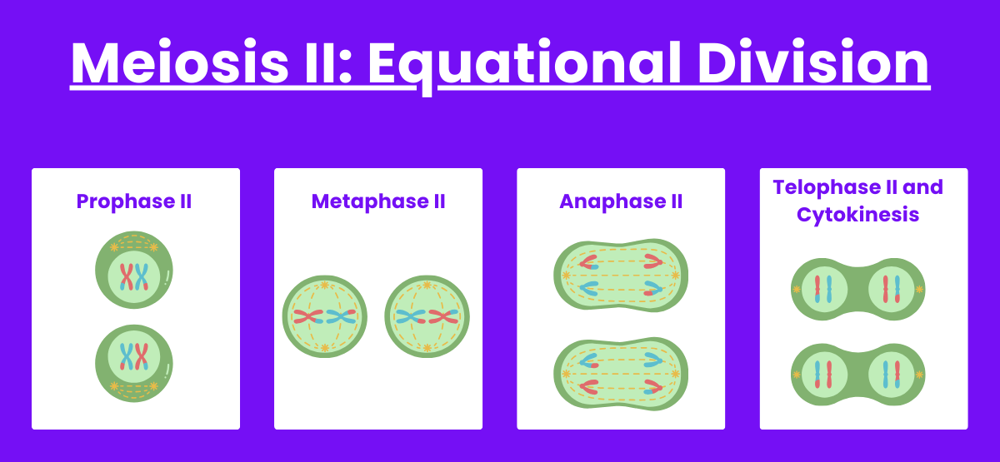

# Meiosis

Meiosis is a specialized form of cell division that **reduces the
chromosome number by half** and results in the **formation of haploid
gametes—sperm and egg cells** in animals, or spores in plants and fungi.
Unlike mitosis, which maintains the diploid chromosome number and
results in genetically identical daughter cells, **meiosis ensures
genetic diversity and is essential for sexual reproduction**. It occurs
**only in germ cells** and comprises **two successive divisions: meiosis
I** and **meiosis II**, following a single round of DNA replication.

The process of meiosis is tightly regulated by a complex interplay of
enzymes, structural proteins, and checkpoints to maintain genome
integrity and ensure proper chromosome segregation. Failures in meiosis
**can lead to aneuploidies such as trisomy 21 (Down syndrome)** and are
a leading cause of miscarriages and infertility.

Figure 1: Meiosis all stages

[Image Credit](https://www.sciencefacts.net/meiosis.html)

## Pre-meotic phase

Prior to entering meiosis, **cells undergo interphase**, which includes
the G1, S, and G2 phases. During the **S phase, DNA replication**
occurs, resulting in each chromosome consisting of two sister chromatids
joined by a centromere. **Enzymes like DNA polymerase, helicase, ligase,
and topoisomerases** play their standard roles in accurately duplicating
the genome. Importantly, cohesin complexes are loaded during this phase
to hold sister chromatids together until anaphase.

Figure 2: Interphase

[Image Credit](https://www.sciencefacts.net/meiosis.html)

## Meosis I: Reductional Divison

The hallmark of meiosis I is the separation of homologous chromosomes,
**reducing the chromosome number from diploid (2n) to haploid (n)**.

Figure 3: Meiosis 1 Reductional Division

[Image
Credit](https://www.examples.com/ap-biology/the-process-and-function-of-meiosis)

### Prophase I

This is the longest and most complex stage of meiosis and is subdivided
into **five stages: leptotene, zygotene, pachytene, diplotene**, and
**diakinesis**.

Figure 4: Stages of Prophase one

[Image
Credit](https://old-ib.bioninja.com.au/higher-level/topic-10-genetics-and-evolu/101-meiosis/stages-of-prophase.html)

During **leptotene**, chromosomes begin to **condense and become
visible**. In **zygotene, homologous chromosomes pair up in a process
known as synapsis**, facilitated by the synaptonemal complex, a protein
structure composed of SYCP1, SYCP2, and SYCP3 proteins.

In **pachytene, crossing over occurs between non-sister chromatids of
homologous chromosomes**. This genetic recombination is catalyzed by the
recombinase enzymes SPO11 (which introduces double-strand breaks),
RAD51, and DMC1 (which facilitate strand invasion and exchange). The
crossover sites are marked by the presence of MLH1, a mismatch repair
protein involved in resolving recombination intermediates.

During **diplotene, the synaptonemal complex disassembles, and
homologous chromosomes begin to separate** but remain **connected at the
crossover points, known as chiasmata**. In **diakinesis, chromosomes are
fully condensed**, and the nuclear envelope breaks down. Spindle
formation begins, regulated by cyclin B/CDK1 complexes.

### Metaphase I

Homologous chromosome pairs **align at the metaphase plate**, with each
chromosome attached to spindle fibers from opposite poles. This
alignment is randomized, contributing to genetic variation (independent
assortment). The spindle checkpoint ensures that all chromosomes are
properly aligned before progression.

Figure 5: Metaphase one

[Image Credit](https://www.sciencefacts.net/meiosis.html)

### Anaphase I

Cohesin complexes along the chromosome arms are cleaved by separase,
allowing homologous chromosomes to separate. However, centromeric
cohesion is protected by shugoshin proteins (SGO1/2), which prevent
separase from cleaving cohesins at the centromere, thus keeping sister
chromatids together.

Figure 6: Anaphase one

[Image Credit](https://www.sciencefacts.net/meiosis.html)

### Telophase I and Cytokinesis

Chromosomes arrive at opposite poles, and the nuclear envelope may
briefly reform. The cell undergoes cytokinesis to form two haploid
daughter cells, each with one set of duplicated chromosomes. These cells
now enter a brief interphase-like state known as interkinesis, without
another round of DNA replication.

Figure 7: Telophase one and Cytokinesis

[Image Credit](https://www.expii.com/t/meiosis-overview-stages-10164)

## Meiosis II: Equational Divison

Meiosis II resembles mitosis in many aspects and involves the separation
of sister chromatids.

Figure 8: Meiosis II Equational Divison

[Image
Credit](https://www.examples.com/ap-biology/the-process-and-function-of-meiosis)

### Prophase II

If the nuclear envelope had reformed in telophase I, it now breaks down
again. Chromosomes condense, and a new spindle apparatus forms.
Centrosomes duplicate and migrate to opposite poles.

Figure 8: Prophase Two

[Image Credit](https://www.sciencefacts.net/meiosis.html)

### Metaphase II

Chromosomes align at the metaphase plate, and spindle fibers from
opposite poles attach to kinetochores of sister chromatids. Aurora B
kinase helps ensure proper tension and attachment.

Figure 9: Metaphase two

[Image Credit](https://www.sciencefacts.net/meiosis.html)

### Anaphase II

The centromeric cohesion is now released by separase, allowing sister
chromatids to separate and move to opposite poles. The spindle
checkpoint ensures fidelity in segregation.

Figure 10: Anaphase two

[Image Credit](https://www.sciencefacts.net/meiosis.html)

### Telophase II and Cytokinesis

Chromosomes decondense, nuclear envelopes reform, and the cytoplasm
divides. This results in four genetically distinct haploid cells, each
containing one complete set of chromosomes. These cells mature into
gametes in animals (sperm or eggs) or spores in plants and fungi.

Figure 11: Telophase two

[Image Credit](https://www.sciencefacts.net/meiosis.html)

## Genetic Diversity Through Meiosis

Meiosis promotes genetic diversity through two principal mechanisms:

**1. Independent assortment** during metaphase I, where maternal and
paternal chromosomes are randomly distributed into daughter cells.

**2. Crossing over** during prophase I, which shuffles alleles between
homologous chromosomes.

These processes ensure that no two gametes are genetically identical, a
foundation for genetic variation in sexually reproducing populations.

## Meiosis Regulation and Disease Associations

The fidelity of meiosis is monitored by multiple checkpoints and
regulated by cyclins, CDKs, kinases (like ATM, ATR, and Aurora B), and
structural proteins.

Errors in meiosis can lead to:

-   **Nondisjunction**, resulting in aneuploid gametes and conditions
    like:
    -   **Down syndrome** (trisomy 21)
    -   **Turner syndrome** (monosomy X)
    -   **Klinefelter syndrome** (XXY)
-   **Infertility**, due to defective homologous recombination or
    spindle attachment
-   **Miscarriages**, oft en caused by chromosomal abnormalities arising
    from meiotic defects

Mutations in meiosis-specific genes such as SPO11, SYCP3, or MLH1 can
impair synapsis or recombination, leading to reproductive failure or
meiotic arrest.

#### REFERENCES

-   Alberts B. et al. (2015). Molecular Biology of the Cell. 6th
    Edition. Garland Science.
-   Reece, J.B. et al. (2022). Campbell Biology. 12th Edition. Pearson.
-   Handel, M.A., & Schimenti, J.C. (2010). Genetics of mammalian
    meiosis: regulation, dynamics and impact on fertility. Nature
    Reviews Genetics, 11(2), 124–136.
-   Keeney, S. (2001). Mechanism and control of meiotic recombination
    initiation. Current Topics in Developmental Biology, 52, 1–53.
-   Hassold, T., & Hunt, P. (2001). To err (meiotically) is human: the
    genesis of human aneuploidy. Nature Reviews Genetics, 2(4), 280–291.
-   NCBI Bookshelf (<https://www.ncbi.nlm.nih.gov/books/>)
-   Nature Cell Biology (<https://www.nature.com/ncb/>)
