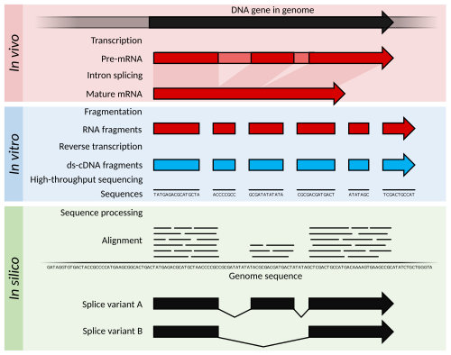

# 🧬 RNA-seq?

**RNA-seq** (RNA sequencing) is a high-throughput sequencing technique
used to measure the complete set of RNA transcripts in a sample — known
as the **transcriptome** — at a specific time.

Figure 1: Summary of RNA-Seq Analysis

[Image Credit](https://en.wikipedia.org/wiki/RNA-Seq)

It helps in:

-   Quantifying gene expression
-   Detecting alternative splicing
-   Discovering novel transcripts
-   Identifying gene fusions

------------------------------------------------------------------------

## 📘 Key Concepts

### 📌 Transcriptome

> The **transcriptome** is the full set of RNA molecules expressed from
> the genome in a specific cell or tissue at a specific time.

It includes:

-   **mRNA** – codes for proteins  
-   **ncRNA** – includes rRNA, tRNA, lncRNA, etc.

------------------------------------------------------------------------

### 📌 Transcript

> A **transcript** is an RNA copy made from a gene through the process
> of transcription.

**DNA → RNA → Protein**  
The RNA level reflects how active (expressed) a gene is.

------------------------------------------------------------------------

### 📌 Gene Expression

> **Gene expression** is the process of creating RNA (and potentially
> protein) from DNA.

RNA-seq quantifies expression levels: - High RNA = Highly expressed
gene - Low RNA = Weakly expressed gene

------------------------------------------------------------------------

### 📌 Alternative Splicing

> A process where different combinations of exons are joined to form
> multiple transcript variants from a single gene.

Example: - Transcript 1: Exon 1 – 2 – 3  
- Transcript 2: Exon 1 – 3

This creates **protein diversity**.

------------------------------------------------------------------------

### 📌 Novel Transcript

> A newly discovered RNA molecule not present in reference databases.

Could be: - An unknown isoform of a known gene - A completely new gene -
A non-coding RNA

RNA-seq allows for their discovery.

------------------------------------------------------------------------

### 📌 Gene Fusion

> Occurs when two distinct genes combine to form a hybrid gene (fusion
> gene), often found in **cancers**.

Example:  
- **BCR-ABL fusion** gene in **chronic myeloid leukemia (CML)**

RNA-seq can detect fusion transcripts by aligning reads that span two
gene loci.

------------------------------------------------------------------------

## 📊 Summary Table

<table>
<colgroup>
<col style="width: 26%" />
<col style="width: 73%" />
</colgroup>
<thead>
<tr class="header">
<th>Concept</th>
<th>Description</th>
</tr>
</thead>
<tbody>
<tr class="odd">
<td><strong>Transcriptome</strong></td>
<td>All RNA molecules in a cell/tissue</td>
</tr>
<tr class="even">
<td><strong>Transcript</strong></td>
<td>RNA sequence copied from a gene</td>
</tr>
<tr class="odd">
<td><strong>Gene Expression</strong></td>
<td>How actively a gene is being transcribed</td>
</tr>
<tr class="even">
<td><strong>Alternative Splicing</strong></td>
<td>A gene producing multiple transcript isoforms</td>
</tr>
<tr class="odd">
<td><strong>Novel Transcript</strong></td>
<td>Newly discovered RNA, not in reference databases</td>
</tr>
<tr class="even">
<td><strong>Gene Fusion</strong></td>
<td>Fusion of two genes causing disease (esp. cancer)</td>
</tr>
</tbody>
</table>

------------------------------------------------------------------------
