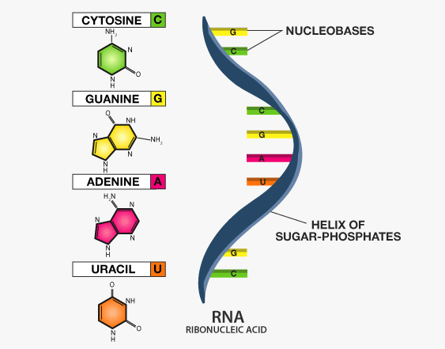

# Ribonucleic Acid (RNA)

RNA (ribonucleic acid) is a nucleic acid similar to DNA but differs in
structure and function. **It plays crucial roles in gene expression,
regulation, and various cellular processes**. Unlike DNA, which
primarily serves as the genetic blueprint, **RNA is involved in
translating and executing genetic instructions**.

## History and Differences from DNA

#### History

-   RNA was first discovered by **Friedrich Miescher** in 1868 along
    with DNA.
-   In the 1930s, researchers realized that RNA played a role in protein
    synthesis.
-   In 1959, Severo Ochoa and Arthur Kornberg won the Nobel Prize for
    discovering the enzymatic synthesis of RNA.
-   The discovery of mRNA (messenger RNA) in 1961 by François Jacob and
    Jacques Monod revealed how genetic information is transmitted from
    DNA to protein synthesis.
-   In the 1980s and beyond, RNA’s catalytic activity (ribozymes) and
    regulatory functions (e.g., miRNA, siRNA) were discovered,
    broadening its biological significance.

## Structure of RNA

RNA is a single-stranded nucleic acid composed of a chain of
nucleotides, each made up of three components:

-   A nitrogenous base
-   A five-carbon sugar (ribose)
-   A phosphate group

Figure 1: Basic Structure of RNA

[Image Credit](https://byjus.com/biology/structure-of-rna/)

### Basic Components of RNA

#### 1. Nitrogenous Bases

RNA includes four bases:

-   Adenine (A)
-   Guanine (G)
-   Cytosine (C)
-   Uracil (U) → Replaces thymine (T) found in DNA

#### Base pairing (if RNA folds upon itself):

-   A pairs with U
-   G pairs with C

RNA can form double-stranded regions (e.g., hairpin loops) by
intramolecular base pairing.

#### 2. Ribose Sugar

-   A **pentose sugar** with a hydroxyl group (-OH) at the 2′ carbon.
-   This hydroxyl group makes RNA **chemically more reactive and less
    stable** than DNA, which has just a hydrogen (-H) at that position
    (deoxyribose).

#### 3. Phosphate Group

-   Attached to the 5′ carbon of ribose.
-   Connects to the 3′ carbon of the next nucleotide via a
    **phosphodiester bond** → forms the **RNA backbone**.

### Primary Structure

-   Linear sequence of nucleotides (e.g., AUGCGUA…)
-   Direction: **5′ → 3′**

Secondary Structure Though RNA is single-stranded, regions within the
strand can base-pair with complementary sequences.

#### Common secondary structures:

-   Hairpins
-   Stem-loops
-   Bulges
-   Pseudoknots

These structures are **essential for function**, especially in tRNA,
rRNA, and ribozymes.

### Tertiary Structure

-   The **3D shape** formed by folding of the secondary structures via:
    -   Hydrogen bonding
    -   Base stacking
    -   Interaction with metal ions or proteins

Examples: \* **tRNA** folds into an L-shaped 3D structure. \* **rRNA**
adopts complex scaffolding to support ribosome function.

#### Significance of RNA Structure

-   Structure determines function: For example,
    -   mRNA must remain linear for translation
    -   tRNA requires precise folding to deliver amino acids
    -   Ribozymes require specific folding to catalyze reactions
-   Mutations or misfolding can affect RNA stability and function,
    leading to diseases.

#### Key Differences Between RNA and DNA

<table>
<colgroup>
<col style="width: 33%" />
<col style="width: 33%" />
<col style="width: 33%" />
</colgroup>
<thead>
<tr class="header">
<th style="text-align: left;">Feature</th>
<th style="text-align: left;">RNA</th>
<th style="text-align: left;">DNA</th>
</tr>
</thead>
<tbody>
<tr class="odd">
<td style="text-align: left;"><strong>Sugar</strong></td>
<td style="text-align: left;">Ribose</td>
<td style="text-align: left;">Deoxyribose</td>
</tr>
<tr class="even">
<td style="text-align: left;"><strong>Strands</strong></td>
<td style="text-align: left;">Single-strabded</td>
<td style="text-align: left;">Double-stranded</td>
</tr>
<tr class="odd">
<td style="text-align: left;"><strong>Bases</strong></td>
<td style="text-align: left;">A, U (Uracil), G, C</td>
<td style="text-align: left;">A, T (Thymine), G, C</td>
</tr>
<tr class="even">
<td style="text-align: left;"><strong>Function</strong></td>
<td style="text-align: left;">Protein synthesis, gene regulation,
catalysis</td>
<td style="text-align: left;">Genetic information storage</td>
</tr>
<tr class="odd">
<td style="text-align: left;"><strong>Stability</strong></td>
<td style="text-align: left;">Less stable (more prone to
degradation)</td>
<td style="text-align: left;">More stable</td>
</tr>
</tbody>
</table>

## Types of RNA and Their Roles

RNA is categorized into different types based on its function in genetic
and cellular processes.

### 1. Messenger RNA (mRNA)

-   **Role**: Carries genetic information from DNA to ribosomes for
    protein synthesis.
-   **Process**: Transcribed from a gene and later translated into a
    protein.
-   **Application in Genomics**: Used in transcriptomics (RNA
    sequencing) to study gene expression patterns.

### 2. Ribosomal RNA (rRNA)

-   **Role**: Forms the core of ribosomes, facilitating protein
    synthesis.
-   **Function**: Provides structural and enzymatic support for
    translation.
-   **Application in Genomics**: Studied in phylogenetics and
    metagenomics to understand species relationships.

### 3. Transfer RNA (tRNA)

-   **Role**: Brings amino acids to ribosomes during translation.
-   **Function**: Matches amino acids to mRNA codons using anticodon
    sequences.
-   **Application in Genomics**: Important in studying protein
    translation efficiency.

### 4. Small Nuclear RNA (snRNA)

-   **Role**: Involved in RNA splicing by forming spliceosomes.
-   **Function**: Helps in intron removal during mRNA processing.
-   **Application in Genomics**: Studied in alternative splicing and
    genetic disorders related to splicing defects.

### 5. Small Nucleolar RNA (snoRNA)

-   **Role**: Guides chemical modifications of rRNA, tRNA, and snRNA.
-   **Function**: Helps in the methylation and pseudouridylation of RNA.
-   **Application in Genomics**: Studied in RNA modifications and
    epitranscriptomics.

### 6. MicroRNA (miRNA)

-   **Role**: Regulates gene expression by binding to target mRNA and
    inhibiting translation or causing degradation.
-   **Function**: Acts as a post-transcriptional regulator.
-   **Application in Genomics**: Used in cancer research, biomarker
    discovery, and gene silencing.

### 7. Small Interfering RNA (siRNA)

-   **Role**: Participates in RNA interference (RNAi) by degrading
    specific mRNAs.
-   **Function**: Silences gene expression at the post-transcriptional
    level.
-   **Application in Genomics**: Used in gene therapy and functional
    genomics studies.

### 8. Long Non-Coding RNA (lncRNA)

-   **Role**: Regulates gene expression at the transcriptional and
    post-transcriptional levels.
-   **Function**: Influences chromatin remodeling, transcription, and
    splicing.
-   **Application in Genomics**: Implicated in diseases such as cancer
    and neurological disorders.

### 9. Ribozymes (Catalytic RNA)

-   **Role**: RNA molecules with enzymatic activity.
-   **Function**: Catalyzes biochemical reactions, such as self-splicing
    or peptide bond formation.
-   **Application in Genomics**: Explored for therapeutic RNA-based
    treatments.

### 10. Circular RNA (circRNA)

-   **Role**: Regulates gene expression and acts as a miRNA sponge.
-   **Function**: May play roles in disease progression and cellular
    signaling.

Application in Genomics: Studied for potential roles in cancer and
neurodegenerative diseases.

## RNA’s Role in Genetics and Genomics

-   **Gene Expression Regulation**: RNA plays a central role in turning
    genes on and off.
-   **Protein Synthesis**: mRNA, rRNA, and tRNA work together to create
    proteins.
-   **RNA Interference (RNAi)**: siRNA and miRNA are used to silence
    genes for research and therapy.
-   **Epigenetic Regulation**: lncRNAs and snoRNAs contribute to
    chromatin modifications.
-   **Disease Mechanisms**: Mutations in RNA-related processes lead to
    diseases like cancer, neurodegenerative disorders, and genetic
    syndromes.
-   **Biotechnology Applications**: RNA-based vaccines (e.g., COVID-19
    mRNA vaccines) and RNA therapeutics (siRNA drugs) are emerging tools
    in medicine.

## Conclusion

RNA is a versatile molecule essential for gene expression, regulation,
and cellular function. Its different types, from mRNA to lncRNA, have
significant roles in genetics and genomics. With advances in RNA
sequencing and therapeutic applications, RNA research continues to
transform medicine and biotechnology.

#### References

-   Alberts, B., Johnson, A., Lewis, J., Raff, M., Roberts, K., &
    Walter, P. (2014). Molecular Biology of the Cell (6th ed.). Garland
    Science.
-   Watson, J. D., Baker, T. A., Bell, S. P., Gann, A., Levine, M., &
    Losick, R. (2017). Molecular Biology of the Gene (7th ed.). Pearson.
-   Cech, T. R., & Steitz, J. A. (2014). “The noncoding RNA
    revolution—Trashing old rules to forge new ones.” Cell, 157(1),
    77-94.
-   Mattick, J. S., & Makunin, I. V. (2006). “Non-coding RNA.” Human
    Molecular Genetics, 15(R1), R17-R29.
-   Bartel, D. P. (2009). “MicroRNAs: Target recognition and regulatory
    functions.” Cell, 136(2), 215-233.
-   Sharp, P. A. (2009). “The centrality of RNA.” Cell, 136(4), 577-580.
-   Doudna, J. A., & Cech, T. R. (2002). “The chemical repertoire of
    natural ribozymes.” Nature, 418(6894), 222-228.
-   Lee, R. C., Feinbaum, R. L., & Ambros, V. (1993). “The C. elegans
    heterochronic gene lin-4 encodes small RNAs with antisense
    complementarity to lin-14.” Cell, 75(5), 843-854.
-   Fire, A., Xu, S., Montgomery, M. K., Kostas, S. A., Driver, S. E., &
    Mello, C. C. (1998). “Potent and specific genetic interference by
    double-stranded RNA in Caenorhabditis elegans.” Nature, 391(6669),
    806-811.
-   Beermann, J., Piccoli, M. T., Viereck, J., & Thum, T. (2016).
    “Non-coding RNAs in development and disease: Background, mechanisms,
    and therapeutic approaches.” Physiological Reviews, 96(4), 1297-

[⬅ Back to Home](../index.md)
