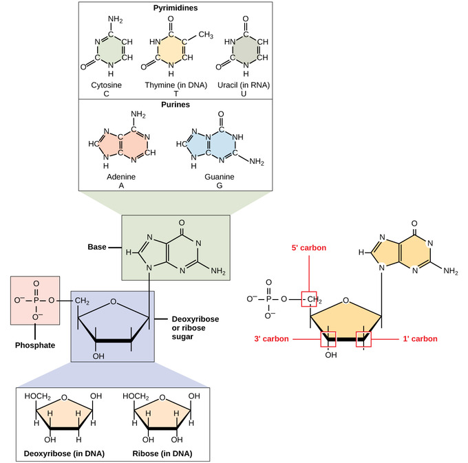
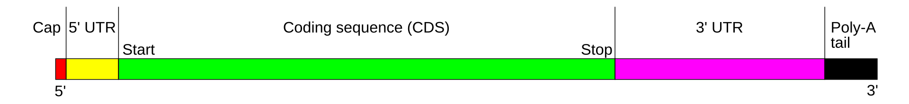

# Ribonucleic Acid (RNA)

RNA (ribonucleic acid) is a nucleic acid similar to DNA but differs in
structure and function. **It plays crucial roles in gene expression,
regulation, and various cellular processes**. Unlike DNA, which
primarily serves as the genetic blueprint, **RNA is involved in
translating and executing genetic instructions**.

## History and Differences from DNA

#### History

-   RNA was first discovered by **Friedrich Miescher** in 1868 along
    with DNA.
-   In the 1930s, researchers realized that RNA played a role in protein
    synthesis.
-   In 1959, Severo Ochoa and Arthur Kornberg won the Nobel Prize for
    discovering the enzymatic synthesis of RNA.
-   The discovery of mRNA (messenger RNA) in 1961 by François Jacob and
    Jacques Monod revealed how genetic information is transmitted from
    DNA to protein synthesis.
-   In the 1980s and beyond, RNA’s catalytic activity (ribozymes) and
    regulatory functions (e.g., miRNA, siRNA) were discovered,
    broadening its biological significance.

## Structure of RNA

RNA is a single-stranded nucleic acid composed of a chain of
nucleotides, each made up of three components:

-   A nitrogenous base
-   A five-carbon sugar (ribose)
-   A phosphate group

Figure 1: Basic Structure of RNA

[Image Credit](https://byjus.com/biology/structure-of-rna/)

### Basic Components of RNA

#### 1. Nitrogenous Bases

RNA includes four bases:

-   Adenine (A)
-   Guanine (G)
-   Cytosine (C)
-   Uracil (U) → Replaces thymine (T) found in DNA

#### Base pairing (if RNA folds upon itself):

-   A pairs with U
-   G pairs with C

RNA can form double-stranded regions (e.g., hairpin loops) by
intramolecular base pairing.

#### 2. Ribose Sugar

-   A **pentose sugar** with a hydroxyl group (-OH) at the 2′ carbon.
-   This hydroxyl group makes RNA **chemically more reactive and less
    stable** than DNA, which has just a hydrogen (-H) at that position
    (deoxyribose).

#### 3. Phosphate Group

-   Attached to the 5′ carbon of ribose.
-   Connects to the 3′ carbon of the next nucleotide via a
    **phosphodiester bond** → forms the **RNA backbone**.

Figure 2: RNA components

[Image
Credit](https://bio.libretexts.org/Courses/Prince_Georges_Community_College/PGCC_Microbiology/02%3A_Chemistry_of_Microbiology/2.05%3A_Organic_Compounds/2.5.04%3A_DNA_and_RNA)

### Primary Structure

-   Linear sequence of nucleotides (e.g., AUGCGUA…)
-   Direction: **5′ → 3′**

Secondary Structure Though RNA is single-stranded, regions within the
strand can base-pair with complementary sequences.

### Common secondary structures:

-   Hairpins
-   Stem-loops
-   Bulges
-   Pseudoknots

These structures are **essential for function**, especially in tRNA,
rRNA, and ribozymes.

### Tertiary Structure

-   The **3D shape** formed by folding of the secondary structures via:
    -   Hydrogen bonding
    -   Base stacking
    -   Interaction with metal ions or proteins

Examples:

-   **tRNA** folds into an L-shaped 3D structure.
-   **rRNA** adopts complex scaffolding to support ribosome function.

Figure 3: RNA primary (left), secondary (middle), and tertiary
structures (right). The RNA folding process is hierarchical, i.e., the
RNA secondary structure forms rapidly from linear RNA (primary
structure) with a large energy loss, while the formation of a complex
tertiary structure is usually much slower.

[Image
Credit](https://journals.plos.org/ploscompbiol/article/figures?id=10.1371/journal.pcbi.1009291)

#### Significance of RNA Structure

-   Structure determines function: For example,
    -   mRNA must remain linear for translation
    -   tRNA requires precise folding to deliver amino acids
    -   Ribozymes require specific folding to catalyze reactions
-   Mutations or misfolding can affect RNA stability and function,
    leading to diseases.

#### Key Differences Between RNA and DNA

<table>
<colgroup>
<col style="width: 33%" />
<col style="width: 33%" />
<col style="width: 33%" />
</colgroup>
<thead>
<tr class="header">
<th style="text-align: left;">Feature</th>
<th style="text-align: left;">RNA</th>
<th style="text-align: left;">DNA</th>
</tr>
</thead>
<tbody>
<tr class="odd">
<td style="text-align: left;"><strong>Sugar</strong></td>
<td style="text-align: left;">Ribose</td>
<td style="text-align: left;">Deoxyribose</td>
</tr>
<tr class="even">
<td style="text-align: left;"><strong>Strands</strong></td>
<td style="text-align: left;">Single-strabded</td>
<td style="text-align: left;">Double-stranded</td>
</tr>
<tr class="odd">
<td style="text-align: left;"><strong>Bases</strong></td>
<td style="text-align: left;">A, U (Uracil), G, C</td>
<td style="text-align: left;">A, T (Thymine), G, C</td>
</tr>
<tr class="even">
<td style="text-align: left;"><strong>Function</strong></td>
<td style="text-align: left;">Protein synthesis, gene regulation,
catalysis</td>
<td style="text-align: left;">Genetic information storage</td>
</tr>
<tr class="odd">
<td style="text-align: left;"><strong>Stability</strong></td>
<td style="text-align: left;">Less stable (more prone to
degradation)</td>
<td style="text-align: left;">More stable</td>
</tr>
</tbody>
</table>

Figure 4: Difference between RNA and DNA

[Image
Credit](https://opentextbc.ca/biology/chapter/9-1-the-structure-of-dna/)

## Types of RNA and Their Roles

RNA is categorized into different types based on its function in genetic
and cellular processes.

### 1. Messenger RNA (mRNA)

**Messenger RNA (mRNA)** is a type of RNA that **carries genetic
information from DNA** in the nucleus to the **ribosomes** in the
cytoplasm, where it is **translated into protein**. It serves as a
**template** for protein synthesis and is **central to gene
expression**.

Figure 5: Central Dogma: Formation of mRNA from DNA

[Image
Credit](https://en.wikipedia.org/wiki/Messenger_RNA#/media/File:Gene_structure_eukaryote_2_annotated.svg)

mRNA is **transcribed from DNA** during **transcription**, and then
processed (in eukaryotes) before being translated. **RNA polymerase**
converts the gene into **pre-mRNA**. During **RNA splicing**, introns
are removed, leaving only **exons**. This exon constitutes **mRNA**.
Genetic information in mRNA is contained in the sequence of
**nucleotide**

Instead of **thymine**, mRNA uses **uracil**. Several steps takes place
to form mature mRNA.

-   **Splicing**: Removes **introns** or **outrons** (non coding region)
    from pre-mRNA.

-   **5’ cap addition**: Also known as **RNA cap**, an **RNA
    7-methylguanosine cap** or **RNA m7G cap**. A 5’ cap is a modified
    guanine nucleotide that has been added to the front or 5’ end of
    mRNA. Its presence is critical for recognition by the ribosome and
    protection from RNases.

-   **Polyadenylation**: Polyadenylation is the covalent linkage of a
    polyadenylyl moiety to a messenger RNA molecule. After the mRNA has
    been cleaved, around **250 adenosine residues** are added to the
    free 3’ end at the cleavage site. This reaction is catalyzed by
    polyadenylate polymerase. Protect mRNA from degradation by
    exonuclease.

-   **Coding regions**: Coding regrions are composed of codons which are
    decoded and translated into proteins by the ribosome. Coding regions
    begin with the **start codon (AUG)** and end with a **stop codon
    (UAA, UAG, UGA)**.

-   **Untranslated region (UTR)**: UTRs are sections of the mRNA before
    the start codon and after the stop codon **that are not
    translated**, termed the **five prime untranslated region (5’ UTR)**
    and **three prime untranslated region (3’ UTR)**, respectively.

-   **Poly(A) tail**: The **3’ poly(A) tail** is a long sequence of
    adenine nucleotides (often several hundred) added to the 3’ end of
    the pre-mRNA. This tail promotes export from the nucleus and
    translation, and protects the mRNA from degradation.

#### Structure of mRNA

The structure of a **eukaryotic mRNA molecule** includes several
**functional regions**:

Figure 6: Structure of mRNA

[Image
Credit](https://en.wikipedia.org/wiki/Messenger_RNA#/media/File:MRNA_structure.svg)

<table>
<colgroup>
<col style="width: 50%" />
<col style="width: 50%" />
</colgroup>
<thead>
<tr class="header">
<th style="text-align: left;">Region</th>
<th style="text-align: left;">Description</th>
</tr>
</thead>
<tbody>
<tr class="odd">
<td style="text-align: left;"><strong>5’Cap</strong></td>
<td style="text-align: left;">A modified guanine nucleotide
(7-methylguanosine) added to the 5′ end. Protects mRNA from degradation
and helps in ribosome binding.</td>
</tr>
<tr class="even">
<td style="text-align: left;"><strong>5′ Untranslated Region (5′
UTR)</strong></td>
<td style="text-align: left;">Regulatory region upstream of the start
codon. Influences translation efficiency and mRNA stability.</td>
</tr>
<tr class="odd">
<td style="text-align: left;"><strong>Coding Sequence
(CDS)</strong></td>
<td style="text-align: left;">The actual protein-coding region, starting
with <strong>AUG (start codon)</strong> and ending with a <strong>stop
codon (UAA, UAG, UGA)</strong>.</td>
</tr>
<tr class="even">
<td style="text-align: left;"><strong>3′ Untranslated Region (3′
UTR)</strong></td>
<td style="text-align: left;">Region downstream of the stop codon.
Regulates stability, localization, and translation.</td>
</tr>
<tr class="odd">
<td style="text-align: left;"><strong>Poly(A) Tail</strong></td>
<td style="text-align: left;">A stretch of adenine nucleotides (~50–250
A’s) added to the 3′ end. Enhances stability and translation.</td>
</tr>
</tbody>
</table>

In prokaryotes, mRNA does not have a 5′ cap or poly(A) tail, and often
encodes multiple proteins (polycistronic).

### Monocistronic versus polycistronic m RNA

Monocistronic mRNA contains the genetic information to translate only a
single protein chain (polypetide). Polycistronic mRNA carries several
**open reading frames**, each of which translated into a polypeptide.
These polypeptides usually have a related functions.

#### Role of mRNA in Genetics and Genomics

#### a. Gene Expression

-   mRNA is the intermediate product between a gene (DNA) and the
    functional product (protein).
-   Gene expression studies (e.g., using RNA-seq) measure mRNA levels to
    understand which genes are active.

#### b. Transcriptomics

-   mRNA is central to transcriptomics, a major field in genomics aimed
    at:
    -   Studying gene expression profiles
    -   Identifying disease biomarkers
    -   Exploring developmental and cellular responses

#### c. Splicing and Isoforms

-   Alternative splicing of pre-mRNA creates **different mRNA isoforms**
    from a single gene → protein diversity.

#### Role of mRNA in Disease

Mutations or misregulation of mRNA can cause diseases in several ways:

-   **Aberrant splicing** → production of dysfunctional proteins. For
    example: Spinal Muscular Atrophy, Beta-Thalassemia
-   **mRNA decay defects** → abnormal accumulation of toxic proteins
-   **Transcriptional dysregulation** → cancer, neurodegeneration

### 2. Ribosomal RNA (rRNA)

**Ribosomal RNA (rRNA)** is a type of **non-coding** RNA that forms the
**core structural and functional components of the ribosome**, which is
the molecular machine responsible for **protein synthesis**
(translation).

rRNA, along with ribosomal proteins, makes up **ribosomes**, which:

-   Read mRNA sequences.
-   Catalyze the formation of peptide bonds between amino acids.

**rRNA is the most abundant type of RNA in the cell (~80–90% of total
RNA).**

#### Structure of rRNA

#### a. Types of rRNA in Eukaryotes

Eukaryotic ribosomes are **80S**, composed of:

-   **60S large subunit**:

    -   **28S rRNA**
    -   **5.8S rRNA**
    -   **5S rRNA**

-   **40S small subunit**:

    -   **18S rRNA**

#### b. Types of rRNA in Prokaryotes

Prokaryotic ribosomes are **70S**, composed of:

-   **50S large subunit**:

    -   **3S rRNA**
    -   **5S rRNA**

-   **30S small subunit**:

-   **16S rRNA**

#### c. Structural Features

-   rRNAs **fold into complex secondary and tertiary structures** with
    stems, loops, bulges, and helices.
-   These folded structures form the **scaffold** for ribosome assembly
    and are crucial for function.
-   rRNAs **interact with ribosomal proteins** and **mRNA/tRNA** to
    coordinate translation.

**23S (prokaryotic) and 28S (eukaryotic) rRNAs have peptidyl transferase
activity, making them ribozymes**.

#### Role of rRNA in Genetics and Genomics

#### a. Protein Synthesis

-   rRNA is the **catalytic engine** of the ribosome.
-   The **ribosome reads mRNA**, aligns tRNAs, and synthesizes proteins.

#### b. Ribosome Biogenesis

-   rRNAs are **transcribed in the nucleolus** (except 5S rRNA).
-   They undergo **modification and cleavage** before forming mature
    ribosomes.

#### c. rRNA Genes in the Genome

-   rRNA genes exist in **repetitive clusters** called **rDNA** (e.g.,
    45S pre-rRNA genes).
-   Located on **nucleolar organizing regions (NORs)** of specific
    chromosomes (in humans: 13, 14, 15, 21, 22).

#### d. Phylogenetics and Evolution

-   **16S (prokaryotic)** and **18S (eukaryotic)** rRNAs are highly
    conserved.
-   Widely used for **species identification** and **evolutionary
    studies** (e.g., 16S rRNA sequencing in microbiome research).

#### Role of rRNA in Disease

<table>
<colgroup>
<col style="width: 33%" />
<col style="width: 33%" />
<col style="width: 33%" />
</colgroup>
<thead>
<tr class="header">
<th style="text-align: left;">Disease</th>
<th style="text-align: left;">Mechanism</th>
<th style="text-align: left;">rRNA Involvement</th>
</tr>
</thead>
<tbody>
<tr class="odd">
<td style="text-align: left;"><strong>Ribosomopathies</strong></td>
<td style="text-align: left;">Inherited disorders affecting ribosome
biogenesis</td>
<td style="text-align: left;">Mutations in rRNA processing genes (e.g.,
TCOF1, DKC1) → defective rRNA</td>
</tr>
<tr class="even">
<td style="text-align: left;"><strong>Treacher Collins
Syndrome</strong></td>
<td style="text-align: left;">Craniofacial defects due to defective
ribosome biogenesis</td>
<td style="text-align: left;">Mutations affect RNA polymerase I/III
transcription of rRNA</td>
</tr>
<tr class="odd">
<td style="text-align: left;"><strong>Cancer</strong></td>
<td style="text-align: left;">Increased ribosome biogenesis and rRNA
transcription</td>
<td style="text-align: left;">Overexpression of rDNA, rRNA, and ribosome
assembly factors</td>
</tr>
<tr class="even">
<td style="text-align: left;"><strong>Dyskeratosis
Congenita</strong></td>
<td style="text-align: left;">Telomerase and rRNA pseudouridylation
defects</td>
<td style="text-align: left;">Mutation in DKC1 affects snoRNA-guided
modification of rRNA</td>
</tr>
</tbody>
</table>

#### Examples and Research Applications

#### a. 16S/18S rRNA Sequencing

-   Used in microbiome studies, environmental microbiology, and
    evolutionary biology.
-   16S rRNA used for bacterial taxonomic classification.
-   18S rRNA used for eukaryotic diversity studies.

#### b. rRNA Modifications

-   rRNA methylation and pseudouridylation help stabilize structure and
    function.
-   Studied via epitranscriptomics (role of RNA modifications in
    health/disease).

#### c. rRNA in Ribosome Profiling

-   Used to map translation efficiency and ribosome occupancy on mRNAs.
-   Helps study translational control in cancer and viral infections.

### 3. Transfer RNA (tRNA)

-   **Role**: Brings amino acids to ribosomes during translation.
-   **Function**: Matches amino acids to mRNA codons using anticodon
    sequences.
-   **Application in Genomics**: Important in studying protein
    translation efficiency.

### 4. Small Nuclear RNA (snRNA)

-   **Role**: Involved in RNA splicing by forming spliceosomes.
-   **Function**: Helps in intron removal during mRNA processing.
-   **Application in Genomics**: Studied in alternative splicing and
    genetic disorders related to splicing defects.

### 5. Small Nucleolar RNA (snoRNA)

-   **Role**: Guides chemical modifications of rRNA, tRNA, and snRNA.
-   **Function**: Helps in the methylation and pseudouridylation of RNA.
-   **Application in Genomics**: Studied in RNA modifications and
    epitranscriptomics.

### 6. MicroRNA (miRNA)

-   **Role**: Regulates gene expression by binding to target mRNA and
    inhibiting translation or causing degradation.
-   **Function**: Acts as a post-transcriptional regulator.
-   **Application in Genomics**: Used in cancer research, biomarker
    discovery, and gene silencing.

### 7. Small Interfering RNA (siRNA)

-   **Role**: Participates in RNA interference (RNAi) by degrading
    specific mRNAs.
-   **Function**: Silences gene expression at the post-transcriptional
    level.
-   **Application in Genomics**: Used in gene therapy and functional
    genomics studies.

### 8. Long Non-Coding RNA (lncRNA)

-   **Role**: Regulates gene expression at the transcriptional and
    post-transcriptional levels.
-   **Function**: Influences chromatin remodeling, transcription, and
    splicing.
-   **Application in Genomics**: Implicated in diseases such as cancer
    and neurological disorders.

### 9. Ribozymes (Catalytic RNA)

-   **Role**: RNA molecules with enzymatic activity.
-   **Function**: Catalyzes biochemical reactions, such as self-splicing
    or peptide bond formation.
-   **Application in Genomics**: Explored for therapeutic RNA-based
    treatments.

### 10. Circular RNA (circRNA)

-   **Role**: Regulates gene expression and acts as a miRNA sponge.
-   **Function**: May play roles in disease progression and cellular
    signaling.

Application in Genomics: Studied for potential roles in cancer and
neurodegenerative diseases.

## RNA’s Role in Genetics and Genomics

-   **Gene Expression Regulation**: RNA plays a central role in turning
    genes on and off.
-   **Protein Synthesis**: mRNA, rRNA, and tRNA work together to create
    proteins.
-   **RNA Interference (RNAi)**: siRNA and miRNA are used to silence
    genes for research and therapy.
-   **Epigenetic Regulation**: lncRNAs and snoRNAs contribute to
    chromatin modifications.
-   **Disease Mechanisms**: Mutations in RNA-related processes lead to
    diseases like cancer, neurodegenerative disorders, and genetic
    syndromes.
-   **Biotechnology Applications**: RNA-based vaccines (e.g., COVID-19
    mRNA vaccines) and RNA therapeutics (siRNA drugs) are emerging tools
    in medicine.

## Conclusion

RNA is a versatile molecule essential for gene expression, regulation,
and cellular function. Its different types, from mRNA to lncRNA, have
significant roles in genetics and genomics. With advances in RNA
sequencing and therapeutic applications, RNA research continues to
transform medicine and biotechnology.

#### References

-   Alberts B. et al. (2014). Molecular Biology of the Cell, 6th Ed.
    Garland Science.
-   Bartel, D. P. (2009). “MicroRNAs: Target recognition and regulatory
    functions.” Cell, 136(2), 215-233.
-   Blanchard, S. C. (2009). “Ribosome dynamics and mRNA translation
    regulation.” Nature Structural & Molecular Biology, 16(6), 664–670.
-   Beermann, J., Piccoli, M. T., Viereck, J., & Thum, T. (2016).
    “Non-coding RNAs in development and disease: Background, mechanisms,
    and therapeutic approaches.” Physiological Reviews, 96(4), 1297-
-   Cech, T. R., & Steitz, J. A. (2014). “The noncoding RNA
    revolution—Trashing old rules to forge new ones.” Cell, 157(1),
    77-94.
-   De Silva, D., et al. (2009). “Ribosome biogenesis in health and
    disease.” Trends in Molecular Medicine, 15(12), 581–585.
-   Doudna, J. A., & Cech, T. R. (2002). “The chemical repertoire of
    natural ribozymes.” Nature, 418(6894), 222-228.
-   Elbashir, S. M. et al. (2001). “Duplexes of 21-nucleotide RNAs
    mediate RNA interference in cultured mammalian cells.” Nature,
    411(6836), 494–498.
-   Finkel, R. S. et al. (2017). “Nusinersen versus sham control in
    infantile-onset spinal muscular atrophy.” New England Journal of
    Medicine, 377(18), 1723–1732.
-   Fire, A., Xu, S., Montgomery, M. K., Kostas, S. A., Driver, S. E., &
    Mello, C. C. (1998). “Potent and specific genetic interference by
    double-stranded RNA in Caenorhabditis elegans.” Nature, 391(6669),
    806-811.
-   Jackson, R. J., Hellen, C. U., & Pestova, T. V. (2010). “The
    mechanism of eukaryotic translation initiation and principles of its
    regulation.” Nature Reviews Molecular Cell Biology, 11(2), 113–127.
-   Karikó, K., Buckstein, M., Ni, H., & Weissman, D. (2005).
    “Suppression of RNA recognition by Toll-like receptors: The impact
    of nucleoside modification and the evolutionary origin of RNA.”
    Immunity, 23(2), 165–175.
-   Lee, R. C., Feinbaum, R. L., & Ambros, V. (1993). “The C. elegans
    heterochronic gene lin-4 encodes small RNAs with antisense
    complementarity to lin-14.” Cell, 75(5), 843-854.
-   Mattick, J. S., & Makunin, I. V. (2006). “Non-coding RNA.” Human
    Molecular Genetics, 15(R1), R17-R29.
-   Moore, M. J., & Proudfoot, N. J. (2009). “Pre-mRNA processing
    reaches back to transcription and ahead to translation.” Cell,
    136(4), 688–700.
-   Penzo, M., & Montanaro, L. (2018). “Turning Uridines around: Role of
    rRNA pseudouridylation in ribosome biogenesis and ribosomal
    function.” Biomolecules, 8(2), 38.
-   Ruggero, D., & Pandolfi, P. P. (2003). “Does the ribosome translate
    cancer?” Nature Reviews Cancer, 3(3), 179–192.
-   Sahin, U., Karikó, K., & Türeci, Ö. (2014). “mRNA-based
    therapeutics—developing a new class of drugs.” Nature Reviews Drug
    Discovery, 13(10), 759–780.
-   Sharp, P. A. (2009). “The centrality of RNA.” Cell, 136(4), 577-580.
-   Wang, Z., & Burge, C. B. (2008). “Splicing regulation: From a parts
    list of regulatory elements to an integrated splicing code.” RNA,
    14(5), 802–813.
-   Warner, J. R., & McIntosh, K. B. (2009). “How common are
    extraribosomal functions of ribosomal proteins?” Molecular Cell,
    34(1), 3–11.
-   Watson, J. D., Baker, T. A., Bell, S. P., Gann, A., Levine, M., &
    Losick, R. (2017). Molecular Biology of the Gene (7th ed.). Pearson.
-   Wilson, D. N., & Doudna Cate, J. H. (2012). “The structure and
    function of the eukaryotic ribosome.” Cold Spring Harbor
    Perspectives in Biology, 4(5), a011536.
-   Woolford, J. L., & Baserga, S. J. (2013). “Ribosome biogenesis in
    the yeast Saccharomyces cerevisiae.” Genetics, 195(3), 643–681.
-   Woese, C. R., & Fox, G. E. (1977). “Phylogenetic structure of the
    prokaryotic domain: The primary kingdoms.” Proceedings of the
    National Academy of Sciences, 74(11), 5088–5090.

[⬅ Back to Home](../index.md)
