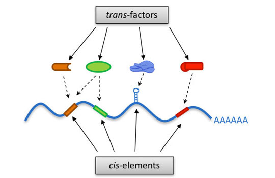
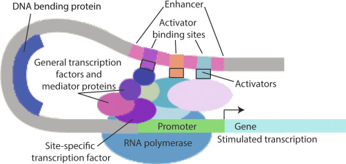
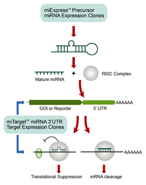
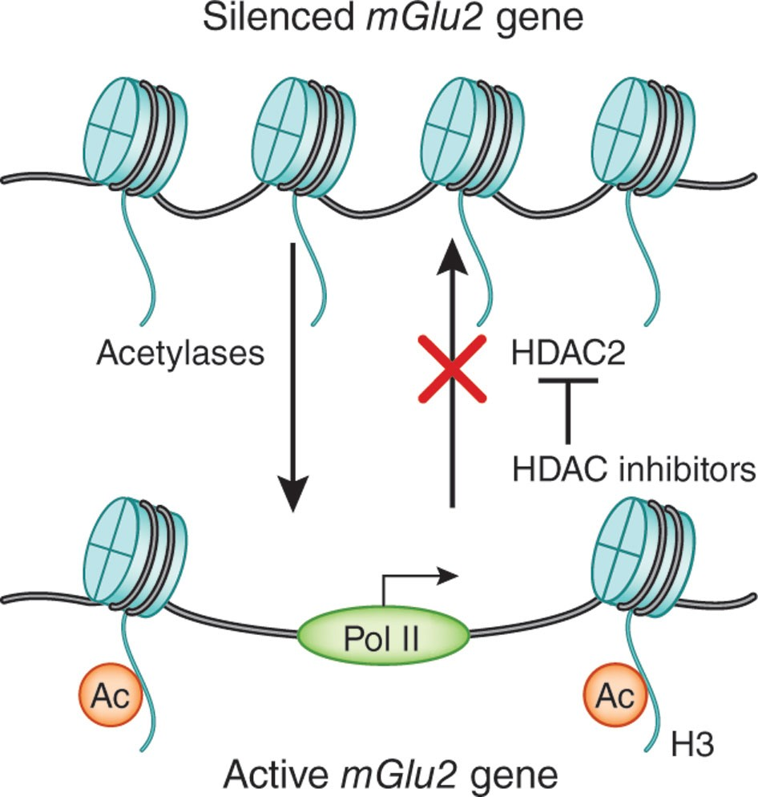
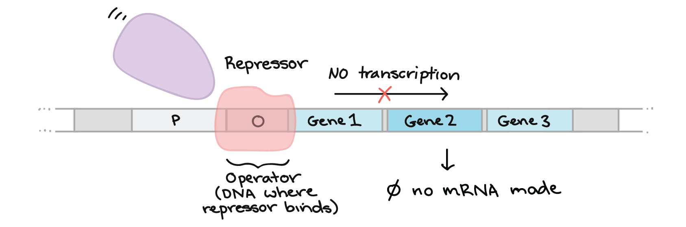

# Trans-Regulatory Elements (TREs)

## Introduction

In molecular genetics, gene expression is regulated by both
**cis-regulatory elements (CREs)** and **trans-regulatory elements
(TREs)**. While **cis-elements** are located near the genes they
regulate (like promoters and enhancers), **trans-elements** act from a
different location in the genome and often encode diffusible factors
like transcription factors (TFs), RNA molecules, and proteins.

-   **Diffuse**: In the context of TREs, the term **“diffuse”** means
    that these molecules (such as **TFs, miRNAs, or regulatory
    proteins**) are **not confined to a specific DNA location**.
    Instead, they **move freely within the nucleus or cytoplasm** and
    can regulate genes located on different chromosomes.

TREs play a crucial role in gene regulation, allowing **a single
regulatory molecule to control multiple genes**, even those located on
different chromosomes.

## Key Characteristics of TREs:

#### 1. Can regulate genes on different chromosomes:

-   Unlike cis-elements, TREs **do not need to be close to the gene**
    they regulate.

#### 2. Encode diffusible molecules:

-   TREs usually **encode proteins or RNAs that travel within the
    nucleus or cytoplasm** to regulate target genes.

#### 3. Often function through protein-DNA or protein-RNA interactions:

-   TREs typically bind to cis-regulatory sequences to modulate gene
    expression.

#### 4. Allow coordinated gene regulation:

-   A single TRE can regulate multiple genes simultaneously, enabling
    **complex biological processes like development, cell
    differentiation, and stress responses**.

Figure 1: Trans-Regulatory Elements and their interaction with
Cis-Regualtory Elements

[Image Credit](http://chenlab.bio.sustech.edu.cn/research)

## How Do Trans-Regulatory Elements Work?

TREs influence gene expression in multiple ways:

-   **1. By binding to CREs in DNA** (e.g., transcription factors like
    p53)

-   **2. By modifying chromatin structure** (e.g., histone-modifying
    enzymes like HDACs)

-   **3. By binding to mRNA and regulating translation** (e.g.,
    microRNAs)

-   **4. By interacting with other proteins that control gene
    expression** (e.g., co-activators like CBP/p300)

Each type of TRE functions differently, but they all help regulate gene
expression across the genome.

## Mechanism of Trans-Regulatory Elements

TREs exert their effects in multiple ways:

### Transcription Factors as TREs

**TFs are proteins that bind to DNA and regulate gene expression by
activating or repressing transcription**. These TFs are encoded by
separate genes and travel to their target sites (bind to **CREs such as
enhancers and promoters**), making them trans-regulatory. These TFs are
encoded by **genes that can be located anywhere in the genome** and can
regulate multiple genes on different chromosomes.

Figure 2: Transcription Factors and Mediator Proteins

[Image
Credit](https://www.sciencedirect.com/topics/neuroscience/transcription-factors)

#### Example: p53 (Tumor Suppressor)

-   **The p53 protein is encoded by the TP53** gene and acts as a
    transcription factor.
-   It **binds to cis-regulatory sequences** in the promoters of genes
    involved in **DNA repair, apoptosis, and cell cycle arrest**.
-   p53 can regulate genes located **on multiple chromosomes**, making
    it a classic trans-regulatory element.

#### Example: MyoD (Muscle Development)

-   The **MyoD protein is a master regulator of muscle
    differentiation**.
-   MyoD binds to E-box sequences (a type of cis-element) in multiple
    muscle-specific genes.
-   By doing this, MyoD **activates genes necessary for muscle cell
    formation, even if they are on different chromosomes**.

### RNA-Based Trans-Regulation

Not all trans-regulatory elements are proteins. Some regulatory RNAs
also function as TREs.

-   Certain **non-coding RNAs (ncRNAs)**, like **microRNAs (miRNAs)**
    and **long non-coding RNAs (lncRNAs)**, act as TREs by modulating
    gene expression post-transcriptionally.

-   **miRNAs** typically bind to the 3’ UTR of target mRNAs, leading to
    mRNA degradation or translational repression.

Figure 4: Translational Suppression by miRNAs

[Image
Credit](https://www.genecopoeia.com/product/mirna-precursor-clone/)

-   **lncRNAs** can serve as scaffolds, enhancers, or decoys to
    influence gene regulation.

Example: miR-21 in Cancer

-   **miR-21** (located on chromosome 17) **downregulates tumor
    suppressor genes like PTEN (chromosome 10) and PDCD4 (chromosome
    10)**, thereby promoting cancer progression.
-   Since **miR-21 does not act on its own locus but targets genes
    elsewhere**, it is considered a TRE.

### Chromatin Modifiers as TREs

Some trans-regulatory elements regulate gene expression by modifying
**chromatin structure**, making genes more or less accessible for
transcription.

Figure 4: HDAC as inhibitors

[Image Credit](https://www.nature.com/articles/nn.3200)

#### Example: Histone Deacetylases (HDACs)

-   **HDACs remove acetyl groups from histones**, leading to chromatin
    condensation and gene repression.
-   Since HDACs are enzymes that move freely and regulate multiple
    genes, they function as trans-regulatory elements.

### Repressor Proteins & Feedback Loops

Some proteins act as repressors by binding to DNA sequences and
**blocking transcription**.

-   These **repressors are produced from genes located elsewhere in the
    genome**, making them trans-regulators.

#### Example: LacI Repressor in the Lac Operon

-   The **lacI gene (encoding the Lac repressor protein)** is located at
    a different position from the lac operon in E. coli.
-   The **LacI repressor binds to the operator region (a cis-element) of
    the lac operon** and prevents transcription until lactose is
    present.
-   Since **LacI is a protein that diffuses to regulate another genetic
    locus**, it is a trans-regulatory element.

Figure 5: Repressor Protein blocking transcription

[Image
Credit](https://www.khanacademy.org/science/ap-biology/gene-expression-and-regulation/regulation-of-gene-expression-and-cell-specialization/a/overview-gene-regulation-in-bacteria)

### Key Differences Between Cis- and Trans-Regulatory Elements

<table>
<colgroup>
<col style="width: 33%" />
<col style="width: 33%" />
<col style="width: 33%" />
</colgroup>
<thead>
<tr class="header">
<th style="text-align: left;">Feature</th>
<th style="text-align: left;">CREs</th>
<th style="text-align: left;">TREs</th>
</tr>
</thead>
<tbody>
<tr class="odd">
<td style="text-align: left;"><strong>Location</strong></td>
<td style="text-align: left;">Near the traget gene</td>
<td style="text-align: left;">Can be anywhere in the genome</td>
</tr>
<tr class="even">
<td style="text-align: left;"><strong>Function</strong></td>
<td style="text-align: left;">Binding sites for regulators</td>
<td style="text-align: left;">Encode proteins/RNAs that regulate
genes</td>
</tr>
<tr class="odd">
<td style="text-align: left;"><strong>Mobility</strong></td>
<td style="text-align: left;">Fixed in the DNA sequence</td>
<td style="text-align: left;">Diffusible molecules</td>
</tr>
<tr class="even">
<td style="text-align: left;"><strong>Examples</strong></td>
<td style="text-align: left;">Promoters, enhancers, silencers</td>
<td style="text-align: left;">Transcription factors, miRNAs,
repressors</td>
</tr>
<tr class="odd">
<td style="text-align: left;"><strong>Regulation</strong></td>
<td style="text-align: left;">Affects only nearby genes</td>
<td style="text-align: left;">Can regulate multiple genes</td>
</tr>
</tbody>
</table>

## Examples of Trans-Regulatory Elements in Humans

### Transcription Factors in Development

-   **PAX6**: Regulates **eye development** by controlling genes
    involved in lens and retina formation, even though these genes are
    located on multiple chromosomes.

-   **Hox genes**: Encode transcription factors that regulate body
    segmentation **across multiple genomic loci**.

### Hormone-Receptor Complexes

-   **Glucocorticoid Receptor (GR)**
    -   The **glucocorticoid receptor (GR) binds to glucocorticoid
        response elements (GREs) in DNA**, influencing genes related to
        inflammation and metabolism.
    -   The **GR gene itself is located on chromosome 5**, but it
        regulates genes across multiple chromosomes.

### microRNAs as Trans-Acting Regulators

-   **miR-34a**: Acts as a **tumor suppressor** by downregulating
    oncogenes.
-   **miR-155**: Regulates immune responses by targeting multiple
    cytokine mRNAs.

### Functional Significance of TREs

Trans-regulatory elements allow **dynamic and coordinated gene
regulation**. Their **diffusible nature** enables:

-   **1. Global responses to cellular signals** (e.g., stress
    responses).
-   **2. Developmental control**, where the same factor regulates
    multiple genes in different tissues.
-   **3. Gene networks**, where multiple genes are turned on/off
    together to execute biological programs.

## Importance of Trans-Regulatory Elements

#### 1. Allow Coordinated Gene Regulation

-   A **single transcription factor can regulate multiple genes across
    the genome**, enabling complex developmental and physiological
    processes.

#### 2. Enable Response to Environmental Cues

-   Hormone receptors (e.g., **GR, estrogen receptor**) allow **cells to
    respond to external signals** by regulating gene expression.

#### 3. Contribute to Disease Mechanisms

-   **Mutations in trans-regulatory elements (like transcription factors
    and miRNAs) can disrupt multiple pathways**, leading to diseases
    like cancer and neurodevelopmental disorders.

## Conclusion

TREs are **essential components of gene regulation** that function
independently of the genomic location of the genes they control. They
**enable dynamic, coordinated, and large-scale regulation of gene
expression**, influencing everything from **development and metabolism
to disease progression**. Their study continues to uncover fundamental
insights into genetics, molecular biology, and medicin

### Reference:

-   Gehring, W. J. (1996). “The master control gene for morphogenesis
    and evolution of the eye.” Genes to Cells, 1(1), 11-15.
-   He, L., & Hannon, G. J. (2004). “MicroRNAs: small RNAs with a big
    role in gene regulation.” Nature Reviews Genetics, 5(7), 522-531.
    DOI: 10.1038/nrg1379
-   Jacob, F., & Monod, J. (1961). “Genetic regulatory mechanisms in the
    synthesis of proteins.” Journal of Molecular Biology, 3(3), 318-356.
-   Krichevsky, A. M., et al. (2005). “A microRNA array reveals
    extensive regulation of microRNAs during brain development.” RNA,
    9(10), 1274-1281.
-   Newton, R. (2000). “Molecular mechanisms of glucocorticoid action:
    What is important?” Thorax, 55(7), 603-613.
-   Seto, E., & Yoshida, M. (2014). “Erasers of histone acetylation: the
    histone deacetylase enzymes.” Cold Spring Harbor Perspectives in
    Biology, 6(4).
-   Weinberg, R. A. (2013). “The Biology of Cancer.” Garland Science.
-   Weintraub, H. (1993). “The MyoD family and myogenesis: redundancy,
    networks, and thresholds.” Cell, 75(7), 1241-1244. DOI:
    10.1016/0092-8674(93)90610-3

[⬅ Back to Home](../index.md)
